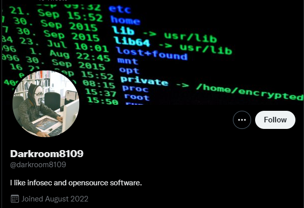
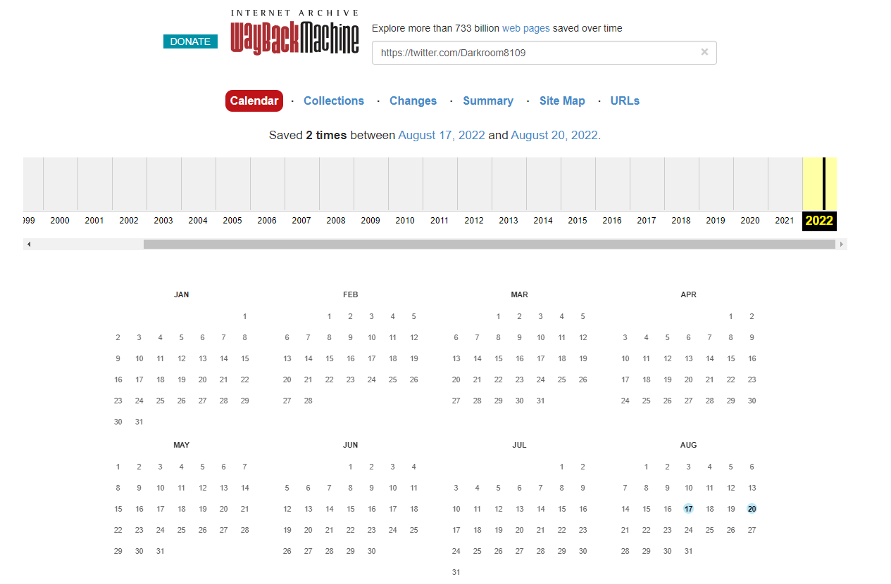
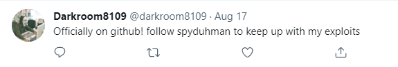
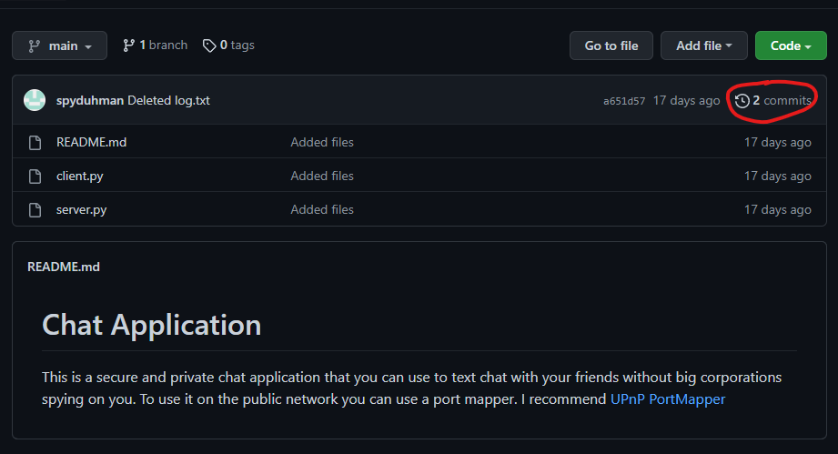
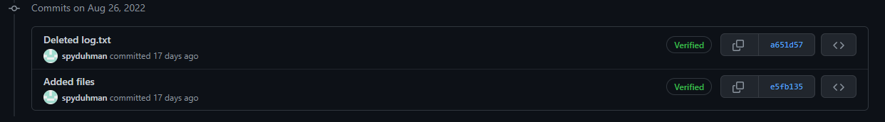
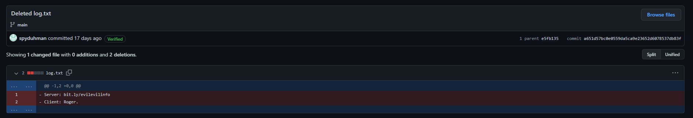
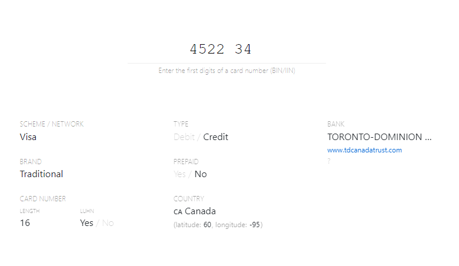
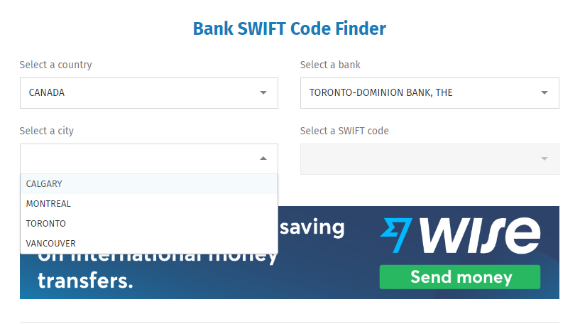
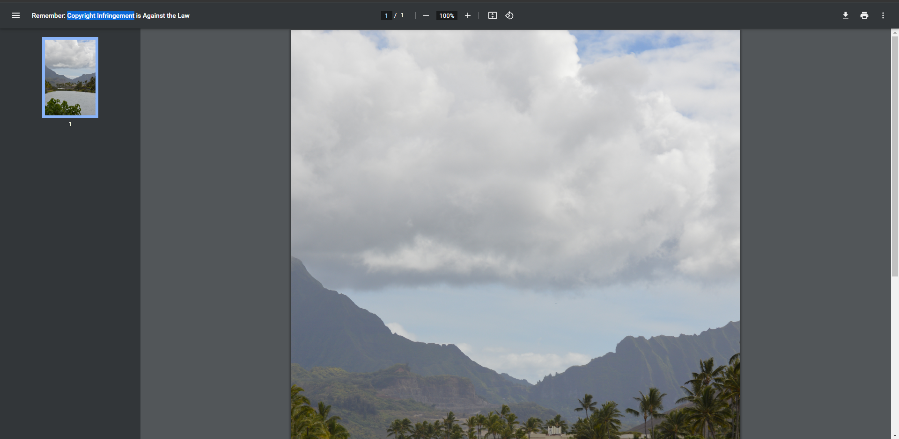

# Our Spy In New Terrain (OSINT)
> It is up to you to determine who The Enemy is going to attack next and when they plan to strike! Their newest recruit is on twitter as DarkRoom8109. Good luck.
## Attachments
> nc misc.chal.csaw.io 5005
---
## Background
OSINT, or open-source intelligence, refers to the collection and gathering of data from publicly available sources to produce meaningful data. You can find out more [here](https://www.crowdstrike.com/cybersecurity-101/osint-open-source-intelligence/) (or do your own osint to find out what it is :)). This challenge is basically an introduction to some common OSINT ideas and while somewhat long, isn't too hard.

# Server
Let's connect to the server first. We recieve a question, which we obviously have to do OSINT to find the answer to.
```
Welcome agent! We have reason to believe a user with the twitter handle Darkroom8109 is working with The Enemy! Can you help us determine what The Enemy is planning?
1. When did the enemy agent join twitter? Please use the format MM/YYYY
Please enter your answer:

```

Most likely, this challenge involves finding several pieces of information, then using thoses pieces to answer questions from the server to finally recieve the flag.

## Question 1
Hopping on Twitter, we can easily search for the user `DarkRoom8109` and also find his twitter join date.



Scrolling down, we can also spot a suspicious tweet:


It's very likely there is sensitive information in one of his deleted tweets, but for now let's just answer the first question
```
1. When did the enemy agent join twitter? Please use the format MM/YYYY
Please enter your answer:
08/2022
That's right!
2. What is the spy's github username?
Please enter your answer:

```
## Question 2
Looking through the other tweets from the account, nothing seems to point to a Github. Let's try seeing if we can access his deleted tweets using the [Wayback Machine](https://web.archive.org/). If you don't know what the Wayback Machine is, it essentially allows you to store "snapsnots" of websites to be archived. Even if the website changes in the future, the snapshot will remain in the Wayback Machine exactly how it was when it was saved. 

[Submitting the URL of the Twitter account](https://web.archive.org/web/20220000000000*/https://twitter.com/Darkroom8109), we find 2 results from August 2022. 



Checking the most recent result (on August 20th), we can see that the deleted tweet does indeed contain a Github username.


```
2. What is the spy's github username?
Please enter your answer:
spyduhman
That's right!
3. What is the full name of the file that contains communications between The Enemy and the Evil Spy?
Please enter your answer:

```
## Question 3
The next step is taking a look at their [Github](https://github.com/spyduhman). We notice they only have one [repository](https://github.com/spyduhman/Chat-App), which seems to be some sort of chat application. It might have been used to as a communication tool (see last question), so let's open it up.



Opening the repository, I noticed there was more than one commit, so let's take a closer look at those.



It seems that `log.txt`, a file in the original commit, was deleted in the second commit. Opening up `log.txt` (clicking show diff in second commit), we see it contains a bit.ly link and a client.



Before visiting the bit.ly link, let's first answer the question.
```
3. What is the full name of the file that contains communications between The Enemy and the Evil Spy?
Please enter your answer:
log.txt
That's right!
4. Which country is the target based in?
Please enter your answer:

```
## Question 4
Now visiting the bit.ly link, we get a file download for [Assignment.wav](Assignment.wav). After downloading the file and playing the sound, it's pretty obvious that it uses Morse code. (You can play via the webpage but its better to have the file for the next part)

You could decode this Morse by hand if you are fluent or something, but I'm not, so let's just use an online tool. I used [this site](https://databorder.com/transfer/morse-sound-receiver/), but any that can recieve a file upload should work. 

After decoding the message, we get this output (seperated into neat lines):
```
HELLO EVIL AGENT YOUR NEXT TARGET IS A BANK 
THE BANK'S BIN NUMBER IS 452234 
THE TARGETS SWIFT CODE IS YOUR PASSWORD 
FOR MORE INSTRUCTIONS VISIT BIT.LY SLASH OSINTSEC 
GOOD LUCK
```

While we might not know exactly what a BIN number is (at least I didn't), we can deduce that it probably has to do with identifying a specific bank, which in this case will also tell us the country of origin. I found [this site](https://binlist.net/) as the first result for `bank bin number lookup`, and it was able to locate the bank just fine, allowing us to answer the question.


```
4. Which country is the target based in?
Please enter your answer:
Canada
That's right!
5. What is the target's international Swift code?
Please enter your answer:

```
## Question 5
Like the BIN number, we can use an online tool to help us look up the Swift code. However, this one requires a little more thought. 



This time I used [this site](https://www.theswiftcodes.com/) to help fill out the information. The first two boxes can simply be copy pasted from the BIN lookup page. However, we have no idea which city this bank branch is in. Thankfully, we still have something that can help us.

Looking back at the decoded Morse in Question 4, we see another bit.ly link: [bit.ly/osintsec](https://bit.ly/osintsec). This leads us to another file download, this time for a PDF called [YoureSoClose](YoureSoClose.pdf). However, this PDF is password protected. Thankfully we know the Swift code is also the password to the PDF from Question 4 as well, so we can just try all possible Swift codes and see if we can view the PDF.

The list we have from the website is
```
TDOMCATT
TDOMCATTCAL
TDOMCATTMTL
TDOMCATTTOR
TDOMCATTVAN
```
Of the 5, `TDOMCATTTOR` allows us to view the PDF, so that must also be the Swift code of the target.

```
5. What is the target's international Swift code?
Please enter your answer:
TDOMCATTTOR
That's right!
6. What is a crime?
What is the answer? Hint: it is two words

```

## Question 6
Now, taking a look at the PDF, we see a picture of some body of water, as well as the answer to the last question.



Submitting the answer to the question, we also get our flag for this challenge.
```
6. What is a crime?
What is the answer? Hint: it is two words
copyright infringement
That's right!
Congrats! Thanks to you, we now have more information about The Enemy's upcoming attack!
Here's a little reward for your trouble: flag{C0N6r475463N7600DW0rKN3X771M3N0PU811C53rV3r}
```

# Conclusion
This challenge is a pretty good intro into OSINT. It goes through common steps like social media, archived content, publicly avaiable lookups, or ways of encoding messages that may not be secure. Obviously there's a lot more to OSINT than just what is shown here, but this is a pretty good example that involves not just looking up the answer.