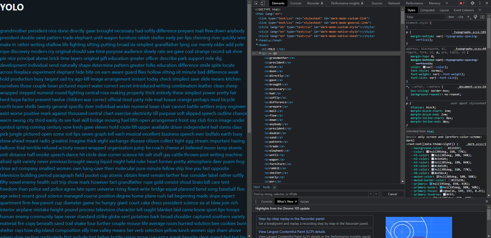

# Word Wide Web
> Isn't the Word Wide Web a fascinating place to be in? Words.. so many words.. all linked... NOTE: The flag doesn't have a wrapper. It needs to be wrapped with curly brackets and please put CTF in front of the curly brackets.
## Attachments
> http://web.chal.csaw.io:5010
---
# Wall o' text
We're only given a single link, so let's open it and see where it goes.
Opening the link, we're greeted with a very empty website, with a single link going to `http://web.chal.csaw.io:5010/stuff`


Clicking on the link, we get greeted with a giant wall of words along with a YOLO header. (If you are following along, your site may look a bit different, but generally its just a lot of blue words)


However, looking through, we don't see anything interesting. Instead, let's look at the actual source code of the page.
We can do this multiple ways: (this is on Chrome/Chromium, might be different for Firefox or Safari)
- Right-click > Inspect
- F12
- Ctrl+Shift+I
  
but regardless of which method we use, we should be able to see the elements of the webpage.

Hovering over the part labeled `<p>...</p>` and clicking, you should see it expand into a list of all the words on the site, as well as the wall of text on the actual webpage be highlighted.


## HTML Elements
You might have noticed that each word is surrounded by `<a>[word]</a>`. In HTML, the main language used for webpages and what you are currently looking at,
elements are defined using an opening and closing tag, in this format: `<[elementtag]>[stuff inside element]</[elementtag]>`, where the `<[elementtag]>` represents the opening
tag and the `</[elementtag]>` represents a closing tag.

In this case, the `a` tag stands for an anchor element. You may have also noticed that the `YOLO` was in an `h1` tag for Heading 1, and the list of `a` tags for the words was itself contained  in a `p` tag for paragraph, similar to how they would be marked in word documents.

An anchor element typically serves as a link to another website, whose URL is defined by the `href` attribute. Attributes of HTML elements are stored inside the opening tag, 
meaning a standard `a` tag would look like `<a href="example.com">Click here</a>`. However, in this case, none of the `a` tags seems to have an href attribute.

### Relative URL
Scrolling down through the list of words, eventually, we will find an `a` tag with an actual `href` attribute. 
(Your word may be different from mine)
```html
        ... (words above)
        <a>believed</a>        
        <a>alike</a>        
        <a>ranch</a>        
        <a href="/factor">factor</a>        
        <a>seldom</a>        
        <a>dug</a>        
        <a>lady</a>        
        <a>differ</a>        
        <a>command</a>
        ... (words below)        
```
Notice that the `href` attribute doesn't contain a full URL. In this case, when you click on the anchor tag, it would bring
you to a URL on the same domain and subdomain (http://web.chal.csaw.io:5010), but to a different page.

This is known as a relative URL, whereas one with the full domain and subdomain would be an absolute URL.

In this case, we are currently on `http://web.chal.csaw.io:5010/stuff`, and when clicked, our full URL would become `http://web.chal.csaw.io:5010/factor`. (or whatever your word is)

## So many words...
Unfortunately, clicking this link only brings us to another wall of text :/.


We can look through the whole list again, or use another feature of the DevTools. Pressing Ctrl+F while looking through the elements, you should see a small bar
pop up near the bottom.


We can use this bar to search for `href` in the HTML of the website by just typing `href` into the bar. Doing so, you should get two results, one for something in the `<head>` element, which you can ignore, and another in the list of words, with an `href` to the same page as the word its on (You might get multiple words but they should all have the same link anyway). This is a lot faster than just scrolling through all the words, and it guarantees you don't miss anything.


However, doing this a few more times, we still have no idea how far we are from the flag, and each new wall of text seems to have nothing new.

## So little time.
Instead, let's try automating this process of getting the `href` and visiting the next word. I'm going to use Python for this part, but any programming language should be fine as long
as you can make web requests and parse strings.

You don't have to worry too much about specific implementation here, just understand what's going on (and why we automate processes instead of doing them manually).

First, I'm going to import the `requests` package. **This isn't a builtin package of Python**, but is really really useful, so I recommend installing it as soon as you download Python. You can install it simply with `pip install requests` in any terminal after you install Python. With the requests package, we can simulate web requests like that of a normal user, just without the actual browser to display anything.

Then, I'm going to define a session to make requests using `requests.Session()`. You can also make requests without a session, but because the words we have visited are stored in a cookie called `solChain`, we need a session to ensure that cookie remains as is. Don't worry about the actual cookie, its not important which is why I didn't explain it, just know we need a persisting session when we use requests.
```py
import requests

s = requests.Session()
```
Next, I can make a request to `http://web.chal.csaw.io:5010/stuff`, and print the output using `r.text`
```py
r = s.get('http://web.chal.csaw.io:5010/stuff')
print(r.text)
```
The printed output will be similar to the HTML we were looking at earlier in DevTools, except it'll be all one giant string. 

Now we can just parse the HTML as a string, and look for the index of `href` in the string. However, remember earlier when I pointed out that there were two `href`s when we searched for them in DevTools?. We have to ignore the first href and instead find the next one. Thankfully, Python (and many other programming languages) has a method to search for the **last** index of a certain substring.

Because we know the HTML tag format, we can use this to parse the HTML. The format looks like `<a href="/[word]">`. This means if we can find the index of `href`, we can then search for the next `>`, and then the part between what we have found will look like `href="/[word]"`.
```py
tag = r.text[r.text.rfind("href="):]
tag = tag[:tag.find(">")]
```
The first line of code just stores the `r.text` from the beginning of the **last** instance of `href=` to the end of the string. The second line then cuts the string to end on the first instance of `>`, leaving something like `href="/[word]"` in `tag`.

Now we can just extract the word and visit the next page using that word. I used a special trick, `exec`. This parses the string as actual Python source code and executes it, which means we now have a variable called `href` that stores the string `"/[word]"`. Finally, we can start the process over again, this time requesting the URL `'http://web.chal.csaw.io:5010' + href`
```py
exec(tag)
r = s.get('http://web.chal.csaw.io:5010'+href) # notice I never defined href
# from here, we can repeat the same process as above
```

### Final solve script
After some cleaning up, this was the final solve script I used using the competition. I started with a loop size of 100 and got lucky, as thats actually the number in the intended solution, but anything over 100 would work as well. However, imagine if we had done this by hand, searching through 100 pages for the next one. 
```py
import requests

s = requests.Session() # session needed to preserve cookie
href = ""
url = "http://web.chal.csaw.io:5010"
for i in range(100): # anything over 100 should work
    r = s.get(url+href)
    q = r.text[r.text.rfind("href="):]
    q = q[:q.find(">")]
    exec(q) # executes 'href = "/[word]"'
    print(href, i) # href now stores a new word
r = s.get(url+href) # url + 100th word
print(r.text) # flag is found here
print(s.cookies) # entire chain of words visited
```
Running the script, we get our final flag:
```
CTF{w0rdS_4R3_4mAz1nG_r1ght}
```

## Conclusion
Obviously this isn't the only way to solve this challenge, but I think it gives a good example of why we use scripts in CTFs instead of doing everything manually. This was a really basic challenge but serves as a good introduction to web in the form of HTML parsing.