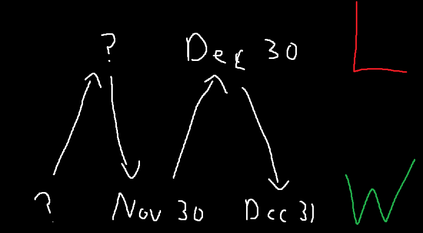
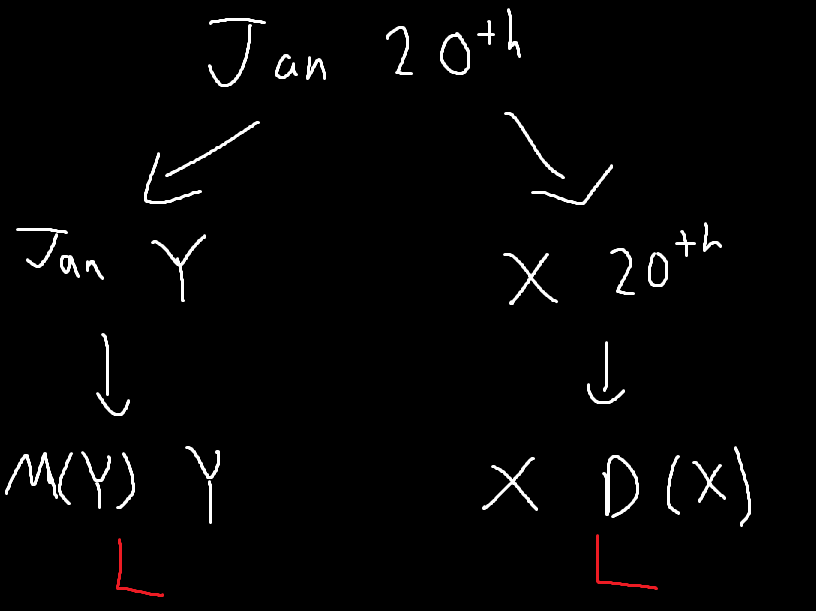

# Neoannophobia
## Description
>Can you beat my game?

## Attachments
>nc neoannophobia.chal.imaginaryctf.org 1337

\- `Neoannophobia (from neos, Greek for "new", and annus, Latin for "year") is the fear of New Year.`

# First look
When we first connect to the server, we get an explanation of the problem.
```
Welcome to neoannophobia, where we are so scared of New Year's that we race to New Year's eve!

In this game, two players take turns saying days of the year ("January 30", "July 5", etc)

The first player may start with any day in the month of January, and on each turn a player may say another date that either has the same month or the same day as the previous date. You can also only progress forward in time, never backwards.

For example, this is a valid series of moves:

Player 1: January 1
Player 2: February 1
Player 1: February 9
Player 2: July 9
Player 1: July 14
Player 2: July 30
Player 1: December 30
Player 2: December 31

This is an illegal set of moves:

Player 1: January 1
Player 2: July 29 (not same day or month)
Player 1: July 1 (going backwards in time)

The objective of the game is simple: be the first player to say December 31.

The computer will choose its own moves, and will always go first. To get the flag, you must win against the computer 100 times in a row.

Ready? You may begin.
```
Obviously, to win 100 times in a row, we have to find a strategy that produces an extremely high chance of winning. However, we know nothing about the
computer's strategy, so we'll have to assume that it can make the most optimal moves. I won't explain the rules to the game as the output is pretty clear. 

## The Beginning
How would we go about planning a strategy to this game? Well, first let's start from our goal.<br/>
Our goal is to be able to say December 31st. This means we either have to force the computer to say a 31st in a month that isn't December, 
or have the computer say a date in December that isn't the 31st. As the moves are forced to be in chronological order, also see that if we say November 30th, 
we essentially just win.

This is because when we say November 30th, the computer's only move is to respond with December 30th. There are no more days left in November, and obviously
the computer can't answer with December 31st. With a response of December 30th, we can say December 31st and claim the victory.

We can map out this logic with `win` and `lose` states. December 31st is the base `win` state, and we just saw that November 30th is a `win` state while 
December 30th is a `lose` state.


But what comes before November 30th?

## The End?
Well, we can apply the same logic that we did to December 31st. If November 30th is the goal, then getting the computer to say October 30th allows us to 
achieve that goal. To do so, we can say October 29th, forcing the computer to pick November 29th. The computer could also pick October 31st or December 29th,
but those instantly allow us to win, which would be pretty dumb of the computer.

We can then just keep repeating this over and over until we reach January, where we see we would want to say January 20th. Therefore, if the computer starts with a move before January 20th, we can just respond with January 20th and follow our predetermined pattern until we win. 

However, what happens if the computer starts with a move after January 20th? Well, in that case, we can jump directly to the associated month that makes that date
a winning state. For example, we would respond to a start of `January 28` with `September 28`. This forces the computer to either respond with September 29/30, or
with October, November and December 28. The first case allows us to go to either October 29 or November 30, which we already know are winning states. Meanwhile,
the second case allows us to go to the associated winning state in that month, which is still October 29 or November 30. Either way, we win.

There's just one problem. What happens if the computer starts with January 20th?  In that case, no matter what we respond with, the computer can always pick a winning 
state. If we choose a different month, the computer just picks the associated winning day on that month. If we choose a different day, the computer again
chooses the winning month for that day. Unfortunately, there is no way to win if the computer plays optimally from the start.


## The End.
Thankfully, from some testing, I found that the first move seems always be random. The computer doesn't seem to have any strategy there, just picking a random date in January.
Also, even when responding with a day before January 20, the computer doesn't always pick it, meaning it doesn't play optimally at least for January. This allows us
to make a script that should guarantee victory unless we get very very unlucky.
```python
import pwn
#nc neoannophobia.chal.imaginaryctf.org 1337
s = pwn.remote('neoannophobia.chal.imaginaryctf.org', 1337)
d = 31
months = ["January", "February", "March", "April", "May", "June", "July", "August", "September", "October", "November", "December"]
dict = {}
rev = {}
for i in range(12):
    dict[months[12-i-1]] = d
    rev[d] = months[12-i-1]
    d -= 1
for i in range(100):
    s.recvuntil(b'ROUND ' + (str(i+1)+"\n").encode())
    s.recvline()
    print(i)
    line = s.recvuntil(b'> ')
    line = line.decode().split()
    # print(line)
    day = int(line[1])
    month = line[0]
    while day != 31 and month != "December":
        target = dict[month]
        if day < target:
            msg = month + " " + str(target) + "\n"
            s.send_raw(msg.encode())
        elif day > target:
            month = rev[day]
            msg = month + " " + str(day) + "\n"
            s.send_raw(msg.encode())
        else:
            day += 1
            msg = month + " " + str(day) + "\n"
            s.send_raw(msg.encode())
        line = s.recvuntil(b'> ')
        line = line.decode().split()
        # print(line)
        day = int(line[1])
        month = line[0]
    s.send_raw(b"December 31\n")
s.interactive()

```
We essentially just look for the closest winning state and attempt to reach it.

Running the program and letting it run for 100 iterations, we get our flag!
```
>>> You won!
>>> ictf{br0ken_game_smh_8b1f014a}
```

## Game Theory
Actually, these types of problems and the reasoning we used to find a strategy is part of mathematical field known as [game theory.](https://en.wikipedia.org/wiki/Game_theory).

In fact, this specific game is very similar to a game of [Nim](https://en.wikipedia.org/wiki/Nim) with 2 piles, one with 31 items and the other with 12. The person 
who removes the last item, basically the person who says December 31st, wins. Only changing the day or month is the same as only being able to remove from 1 pile at 
a time.

But hey, that's just a theory, a GAME theory. <sub>sorry it was too tempting</sub>

# Conclusion
A really cool misc challenge, combining some algorithmic thinking and logic. Unfortunately didn't see this problem or I would've gone for first blood :cry: