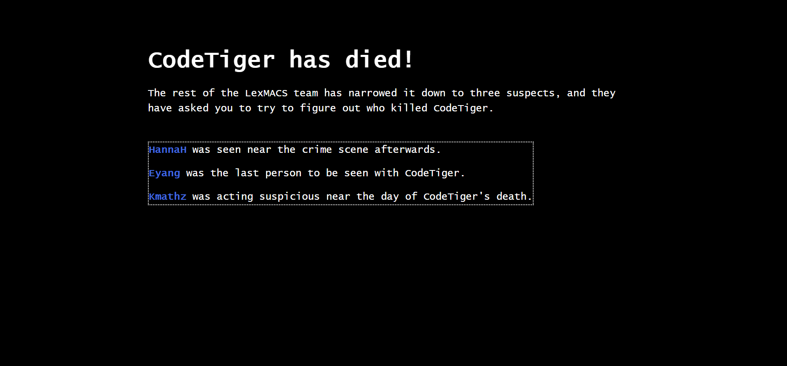
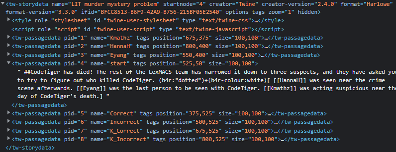

# MURDER MYSTERY
## Description
>LIT murder mystery... who could be the culprit? Please wrap it in `LITCTF{}`
## Attachments
>[Website](http://litctf.live:31774/)

<details>
    <summary>Hint</summary>

    Some things are like the apparition of CodeTiger. He may appear to have zero mass or width, effectively invisible, but he's still always there with us <3
</details>

---
# First look
Taking a look at the site, we see what seems to be a point-and-click adventure.



Each name is clickable and leads to a seperate view with some different information.
Both the Eyang and Kmathz seem to require passwords, meaning we can't see them for now.

From here, I took a look at the source to see if there was anything unusual. <br/>
In the source, we can actually see each individual view in the element `tw-storydata` as its own `tw-passagedata` element. <br/>
We started on passage 4, which matches with what's in the element. <br/>


## Sus
After extracting all the [data](scriptdata.html), there is a huge chunk of text in `K_Correct`.
```html
CodeTiger's dictatorship becomes more unbearable with each passing day. I hate every cell in his body. Every day, my
blood boils as I witness him. LexMACS is an organization gathering the
world's&#xFEFF;&zwnj;&ZeroWidthSpace;&ZeroWidthSpace;&zwnj;&ZeroWidthSpace;&ZeroWidthSpace;&ZeroWidthSpace;&NoBreak;&zwnj;&zwnj;&ZeroWidthSpace;&ZeroWidthSpace;&zwnj;&ZeroWidthSpace;&zwnj;&NoBreak;&zwnj;&zwnj;&ZeroWidthSpace;&zwnj;&zwnj;&ZeroWidthSpace;&ZeroWidthSpace;&NoBreak;&zwnj;&zwnj;&ZeroWidthSpace;&zwnj;&zwnj;&ZeroWidthSpace;&ZeroWidthSpace;&NoBreak;&zwnj;&zwnj;&ZeroWidthSpace;&zwnj;&zwnj;&zwnj;&zwnj;&NoBreak;&zwnj;&ZeroWidthSpace;... (many many more entities)
most ambitious and brightest programmers, yet we all suffocate under his iron first.

No, it can't be like this! Something needs to be done. Nay. Something MUST be done. For LexMACS, for the CS
community, and for all of humanity.

The time has come, and I will rise to the occasion.
```
This is already super sus, and if we try to render the entities, we get:
```
‌​​‌​​​⁠‌‌​​‌​‌⁠‌‌​‌‌​​⁠‌‌​‌‌​​⁠‌‌​‌‌‌‌⁠‌​​​​​⁠‌‌​​‌‌​⁠‌‌​​‌​‌⁠‌‌​‌‌​​⁠‌‌​‌‌​​⁠‌‌​‌‌‌‌⁠‌‌‌​‌‌‌⁠‌​​​​​⁠‌​​​​‌‌⁠‌‌​‌‌‌‌⁠‌‌​​‌​​⁠‌‌​​‌​‌⁠‌​‌​‌​​⁠‌‌​‌​​‌⁠‌‌​​‌‌‌⁠‌‌​​‌​‌⁠‌‌‌​​‌​⁠‌​​​​​⁠‌​​‌‌​​⁠‌‌​‌‌‌‌⁠‌‌‌‌​​‌⁠‌‌​​​​‌⁠‌‌​‌‌​​⁠‌‌​‌​​‌⁠‌‌‌​​‌‌⁠‌‌‌​‌​​⁠‌‌‌​​‌‌⁠‌​‌‌‌​⁠‌​​​​​⁠‌​​​‌​​⁠‌‌‌​‌​‌⁠‌‌​​‌​‌⁠‌​​​​​⁠‌‌‌​‌​​⁠‌‌​‌‌‌‌⁠‌​​​​​⁠‌‌​‌‌‌‌⁠‌‌‌​‌​‌⁠‌‌‌​​‌​⁠‌​​​​​⁠‌‌​‌​‌​⁠‌‌​‌‌‌‌⁠‌‌​‌​​‌⁠‌‌​‌‌‌​⁠‌‌‌​‌​​⁠‌​​​​​⁠‌‌​​‌​‌⁠‌‌​​‌‌​⁠‌‌​​‌‌​⁠‌‌​‌‌‌‌⁠‌‌‌​​‌​⁠‌‌‌​‌​​⁠‌​‌‌​​⁠‌​​​​​⁠‌‌​‌​​​⁠‌‌​‌​​‌⁠‌‌‌​​‌‌⁠‌​​​​​⁠‌‌​​‌​‌⁠‌‌‌​​‌‌⁠‌‌​​​‌‌⁠‌‌​​​​‌⁠‌‌‌​​​​⁠‌‌​​‌​‌⁠‌​​​​​⁠‌‌​‌​​​⁠‌‌​​​​‌⁠‌‌‌​​‌‌⁠‌​​​​​⁠‌‌​​​‌​⁠‌‌​​‌​‌⁠‌‌​​‌​‌⁠‌‌​‌‌‌​⁠‌​​​​​⁠‌‌‌​​‌‌⁠‌‌‌​‌​‌⁠‌‌​​​‌‌⁠‌‌​​​‌‌⁠‌‌​​‌​‌⁠‌‌‌​​‌‌⁠‌‌‌​​‌‌⁠‌‌​​‌‌​⁠‌‌‌​‌​‌⁠‌‌​‌‌​​⁠‌​‌‌‌​⁠‌​​​​​⁠‌​‌​‌​​⁠‌‌​‌​​​⁠‌‌​​‌​‌⁠‌​​​​​⁠‌‌​‌‌‌​⁠‌‌​‌‌‌‌⁠‌‌​‌‌‌​⁠‌​‌‌​‌⁠‌​​‌‌​​⁠‌‌​‌‌‌‌⁠‌‌‌‌​​‌⁠‌‌​​​​‌⁠‌‌​‌‌​​⁠‌‌​‌​​‌⁠‌‌‌​​‌‌⁠‌‌‌​‌​​⁠‌‌‌​​‌‌⁠‌​​​​​⁠‌‌​‌‌​‌⁠‌‌​​​​‌⁠‌‌‌‌​​‌⁠‌​​​​​⁠‌‌‌​‌​​⁠‌‌​‌​​​⁠‌‌​‌​​‌⁠‌‌​‌‌‌​⁠‌‌​‌​‌‌⁠‌​​​​​⁠‌‌​‌​​​⁠‌‌​‌​​‌⁠‌‌​‌‌​‌⁠‌​​​​​⁠‌‌​​‌‌‌⁠‌‌​‌‌‌‌⁠‌‌​‌‌‌​⁠‌‌​​‌​‌⁠‌​‌‌​​⁠‌​​​​​⁠‌‌​​​‌​⁠‌‌‌​‌​‌⁠‌‌‌​‌​​⁠‌​​​​​⁠‌‌‌​‌‌‌⁠‌‌​​‌​‌⁠‌​​​​​⁠‌‌​‌​‌‌⁠‌‌​‌‌‌​⁠‌‌​‌‌‌‌⁠‌‌‌​‌‌‌⁠‌​​​​​⁠‌‌‌​‌​​⁠‌‌​‌​​​⁠‌‌​​‌​‌⁠‌​​​​​⁠‌‌‌​‌​​⁠‌‌‌​​‌​⁠‌‌‌​‌​‌⁠‌‌‌​‌​​⁠‌‌​‌​​​⁠‌​‌‌‌​⁠‌​​​​​⁠‌​​‌​​​⁠‌‌​​‌​‌⁠‌​​​​​⁠‌‌​‌​​‌⁠‌‌‌​​‌‌⁠‌​​​​​⁠‌‌​‌‌​‌⁠‌‌​​‌​‌⁠‌‌‌​​‌​⁠‌‌​​‌​‌⁠‌‌​‌‌​​⁠‌‌‌‌​​‌⁠‌​​​​​⁠‌‌​‌‌​​⁠‌‌‌‌​​‌⁠‌‌​‌​​‌⁠‌‌​‌‌‌​⁠‌‌​​‌‌‌⁠‌​​​​​⁠‌‌​‌​​‌⁠‌‌​‌‌‌​⁠‌​​​​​⁠‌‌‌​‌‌‌⁠‌‌​​​​‌⁠‌‌​‌​​‌⁠‌‌‌​‌​​⁠‌​​​​​⁠‌‌‌​‌​​⁠‌‌​‌‌‌‌⁠‌​​​​​⁠‌‌‌​​‌​⁠‌‌​​‌​‌⁠‌‌‌​‌​​⁠‌‌‌​‌​‌⁠‌‌‌​​‌​⁠‌‌​‌‌‌​⁠‌​​​​​⁠‌‌‌​‌‌‌⁠‌‌​‌​​‌⁠‌‌‌​‌​​⁠‌‌​‌​​​⁠‌​​​​​⁠‌‌​​​​‌⁠‌‌​‌‌‌​⁠‌​​​​​⁠‌​​‌‌​​⁠‌​​‌​​‌⁠‌​‌​‌​​⁠‌​​​​​⁠‌‌‌​​​​⁠‌‌‌​​‌​⁠‌‌​‌‌‌‌⁠‌‌​​​‌​⁠‌‌​‌‌​​⁠‌‌​​‌​‌⁠‌‌​‌‌​‌⁠‌​​​​​⁠‌‌‌​‌​​⁠‌‌​‌‌‌‌⁠‌​​​​​⁠‌‌​​‌​​⁠‌‌​​​​‌⁠‌‌‌‌​‌​⁠‌‌‌‌​‌​⁠‌‌​‌‌​​⁠‌‌​​‌​‌⁠‌​​​​​⁠‌‌‌​‌​‌⁠‌‌‌​​‌‌⁠‌​​​​​⁠‌‌​​​​‌⁠‌‌​‌‌​​⁠‌‌​‌‌​​⁠‌​‌‌‌​⁠‌​​​​​⁠‌​​‌‌​​⁠‌‌​​‌​‌⁠‌‌‌​‌​​⁠‌​​​​​⁠‌‌​‌​​‌⁠‌‌‌​‌​​⁠‌​​​​​⁠‌‌​​​‌​⁠‌‌​​‌​‌⁠‌​​​​​⁠‌‌​‌​‌‌⁠‌‌​‌‌‌​⁠‌‌​‌‌‌‌⁠‌‌‌​‌‌‌⁠‌‌​‌‌‌​⁠‌‌‌​‌​⁠‌‌​‌⁠‌​‌​⁠‌‌​‌⁠‌​‌​⁠‌​​​​‌‌⁠‌‌​​​​⁠‌‌​​‌​​⁠‌​​​‌​‌⁠‌‌‌​‌​​⁠‌‌​​​‌⁠‌​​​‌‌‌⁠‌‌​​‌​‌⁠‌​‌​​‌​⁠‌​‌‌‌‌‌⁠‌​​‌‌​​⁠‌‌​​​‌⁠‌​‌​‌‌​⁠‌​​​‌​‌⁠‌​‌​​‌‌
```
It doesn't even show up! What is going on here?

## Zero-width space
These type of characters are known as zero-width spaces. When rendered, they show up as nothing, but when read as text, they still occupy space and are
valid Unicode characters.
In this case, we have a super large chunk of different types of zero-width spaces. If we were to view them on the site, we would see nothing, but
we can still extract them from the source.

## Text analysis
Thankfully, Python uses unicode strings, meaning we can still parse it programatically.
```python
from collections import Counter
s = "‌​​‌​​​⁠‌‌​​‌​‌⁠‌‌​‌‌​​⁠‌‌​‌‌​​⁠‌‌​‌‌‌‌⁠‌​​​​​⁠‌‌​​‌‌​⁠‌‌​​‌​‌⁠‌‌​‌‌​​⁠‌‌​‌‌​​⁠‌‌​‌‌‌‌⁠‌‌‌​‌‌‌⁠‌​​​​​⁠‌​​​​‌‌⁠‌‌​‌‌‌‌⁠‌‌​​‌​​⁠‌‌​​‌​‌⁠‌​‌​‌​​⁠‌‌​‌​​‌⁠‌‌​​‌‌‌⁠‌‌​​‌​‌⁠‌‌‌​​‌​⁠‌​​​​​⁠‌​​‌‌​​⁠‌‌​‌‌‌‌⁠‌‌‌‌​​‌⁠‌‌​​​​‌⁠‌‌​‌‌​​⁠‌‌​‌​​‌⁠‌‌‌​​‌‌⁠‌‌‌​‌​​⁠‌‌‌​​‌‌⁠‌​‌‌‌​⁠‌​​​​​⁠‌​​​‌​​⁠‌‌‌​‌​‌⁠‌‌​​‌​‌⁠‌​​​​​⁠‌‌‌​‌​​⁠‌‌​‌‌‌‌⁠‌​​​​​⁠‌‌​‌‌‌‌⁠‌‌‌​‌​‌⁠‌‌‌​​‌​⁠‌​​​​​⁠‌‌​‌​‌​⁠‌‌​‌‌‌‌⁠‌‌​‌​​‌⁠‌‌​‌‌‌​⁠‌‌‌​‌​​⁠‌​​​​​⁠‌‌​​‌​‌⁠‌‌​​‌‌​⁠‌‌​​‌‌​⁠‌‌​‌‌‌‌⁠‌‌‌​​‌​⁠‌‌‌​‌​​⁠‌​‌‌​​⁠‌​​​​​⁠‌‌​‌​​​⁠‌‌​‌​​‌⁠‌‌‌​​‌‌⁠‌​​​​​⁠‌‌​​‌​‌⁠‌‌‌​​‌‌⁠‌‌​​​‌‌⁠‌‌​​​​‌⁠‌‌‌​​​​⁠‌‌​​‌​‌⁠‌​​​​​⁠‌‌​‌​​​⁠‌‌​​​​‌⁠‌‌‌​​‌‌⁠‌​​​​​⁠‌‌​​​‌​⁠‌‌​​‌​‌⁠‌‌​​‌​‌⁠‌‌​‌‌‌​⁠‌​​​​​⁠‌‌‌​​‌‌⁠‌‌‌​‌​‌⁠‌‌​​​‌‌⁠‌‌​​​‌‌⁠‌‌​​‌​‌⁠‌‌‌​​‌‌⁠‌‌‌​​‌‌⁠‌‌​​‌‌​⁠‌‌‌​‌​‌⁠‌‌​‌‌​​⁠‌​‌‌‌​⁠‌​​​​​⁠‌​‌​‌​​⁠‌‌​‌​​​⁠‌‌​​‌​‌⁠‌​​​​​⁠‌‌​‌‌‌​⁠‌‌​‌‌‌‌⁠‌‌​‌‌‌​⁠‌​‌‌​‌⁠‌​​‌‌​​⁠‌‌​‌‌‌‌⁠‌‌‌‌​​‌⁠‌‌​​​​‌⁠‌‌​‌‌​​⁠‌‌​‌​​‌⁠‌‌‌​​‌‌⁠‌‌‌​‌​​⁠‌‌‌​​‌‌⁠‌​​​​​⁠‌‌​‌‌​‌⁠‌‌​​​​‌⁠‌‌‌‌​​‌⁠‌​​​​​⁠‌‌‌​‌​​⁠‌‌​‌​​​⁠‌‌​‌​​‌⁠‌‌​‌‌‌​⁠‌‌​‌​‌‌⁠‌​​​​​⁠‌‌​‌​​​⁠‌‌​‌​​‌⁠‌‌​‌‌​‌⁠‌​​​​​⁠‌‌​​‌‌‌⁠‌‌​‌‌‌‌⁠‌‌​‌‌‌​⁠‌‌​​‌​‌⁠‌​‌‌​​⁠‌​​​​​⁠‌‌​​​‌​⁠‌‌‌​‌​‌⁠‌‌‌​‌​​⁠‌​​​​​⁠‌‌‌​‌‌‌⁠‌‌​​‌​‌⁠‌​​​​​⁠‌‌​‌​‌‌⁠‌‌​‌‌‌​⁠‌‌​‌‌‌‌⁠‌‌‌​‌‌‌⁠‌​​​​​⁠‌‌‌​‌​​⁠‌‌​‌​​​⁠‌‌​​‌​‌⁠‌​​​​​⁠‌‌‌​‌​​⁠‌‌‌​​‌​⁠‌‌‌​‌​‌⁠‌‌‌​‌​​⁠‌‌​‌​​​⁠‌​‌‌‌​⁠‌​​​​​⁠‌​​‌​​​⁠‌‌​​‌​‌⁠‌​​​​​⁠‌‌​‌​​‌⁠‌‌‌​​‌‌⁠‌​​​​​⁠‌‌​‌‌​‌⁠‌‌​​‌​‌⁠‌‌‌​​‌​⁠‌‌​​‌​‌⁠‌‌​‌‌​​⁠‌‌‌‌​​‌⁠‌​​​​​⁠‌‌​‌‌​​⁠‌‌‌‌​​‌⁠‌‌​‌​​‌⁠‌‌​‌‌‌​⁠‌‌​​‌‌‌⁠‌​​​​​⁠‌‌​‌​​‌⁠‌‌​‌‌‌​⁠‌​​​​​⁠‌‌‌​‌‌‌⁠‌‌​​​​‌⁠‌‌​‌​​‌⁠‌‌‌​‌​​⁠‌​​​​​⁠‌‌‌​‌​​⁠‌‌​‌‌‌‌⁠‌​​​​​⁠‌‌‌​​‌​⁠‌‌​​‌​‌⁠‌‌‌​‌​​⁠‌‌‌​‌​‌⁠‌‌‌​​‌​⁠‌‌​‌‌‌​⁠‌​​​​​⁠‌‌‌​‌‌‌⁠‌‌​‌​​‌⁠‌‌‌​‌​​⁠‌‌​‌​​​⁠‌​​​​​⁠‌‌​​​​‌⁠‌‌​‌‌‌​⁠‌​​​​​⁠‌​​‌‌​​⁠‌​​‌​​‌⁠‌​‌​‌​​⁠‌​​​​​⁠‌‌‌​​​​⁠‌‌‌​​‌​⁠‌‌​‌‌‌‌⁠‌‌​​​‌​⁠‌‌​‌‌​​⁠‌‌​​‌​‌⁠‌‌​‌‌​‌⁠‌​​​​​⁠‌‌‌​‌​​⁠‌‌​‌‌‌‌⁠‌​​​​​⁠‌‌​​‌​​⁠‌‌​​​​‌⁠‌‌‌‌​‌​⁠‌‌‌‌​‌​⁠‌‌​‌‌​​⁠‌‌​​‌​‌⁠‌​​​​​⁠‌‌‌​‌​‌⁠‌‌‌​​‌‌⁠‌​​​​​⁠‌‌​​​​‌⁠‌‌​‌‌​​⁠‌‌​‌‌​​⁠‌​‌‌‌​⁠‌​​​​​⁠‌​​‌‌​​⁠‌‌​​‌​‌⁠‌‌‌​‌​​⁠‌​​​​​⁠‌‌​‌​​‌⁠‌‌‌​‌​​⁠‌​​​​​⁠‌‌​​​‌​⁠‌‌​​‌​‌⁠‌​​​​​⁠‌‌​‌​‌‌⁠‌‌​‌‌‌​⁠‌‌​‌‌‌‌⁠‌‌‌​‌‌‌⁠‌‌​‌‌‌​⁠‌‌‌​‌​⁠‌‌​‌⁠‌​‌​⁠‌‌​‌⁠‌​‌​⁠‌​​​​‌‌⁠‌‌​​​​⁠‌‌​​‌​​⁠‌​​​‌​‌⁠‌‌‌​‌​​⁠‌‌​​​‌⁠‌​​​‌‌‌⁠‌‌​​‌​‌⁠‌​‌​​‌​⁠‌​‌‌‌‌‌⁠‌​​‌‌​​⁠‌‌​​​‌⁠‌​‌​‌‌​⁠‌​​​‌​‌⁠‌​‌​​‌‌" # the entire thing is in here
print(len(s))
c = Counter(s)
print(c)
>>> 2030
>>> Counter({'\u200c': 954, '\u200b': 813, '\u2060': 261, '\ufeff': 2})
```
It's pretty suspicious that there's only two `\ufeff` characters, so looking around, I noticed it only appeared at the start and the end, meaning
we can just ignore it as it's probably used to enclose the entire message.

Finally, there is way more `\u200c` and `\u200b` than `\u2060` characters, which also seems weird. 

I tried splitting by these `\u2060` characters to see if anything would show up.
```python
s = s[1:-1]
s = s.split("\u2060")
print(len(s))
print(list(len(i) for i in s))
```
And we get a pretty surprising result:
```
[7, 7, 7, 7, 7, 6, 7, 7, 7, 7, 7, 7, 6, 7, 7, 7, 7, 7, 7, 7, 7, 7, 6, 7, 7, 7, 7, 7, 7, 7, 7, 7, 6, 6, 7, 7, 7, 6, 7, 7, 6, 7, 7, 7, 6, 7, 7, 7, 7, 7, 6, 7, 7, 7, 7, 7, 7, 6, 6, 7, 7, 7, 6, 7, 7, 7, 7, 7, 7, 6, 7, 7, 7, 6, 7, 7, 7, 7, 6, 7, 7, 7, 7, 7, 7, 7, 7, 7, 7, 6, 6, 7, 7, 7, 6, 7, 7, 7, 6, 7, 7, 7, 7, 7, 7, 7, 7, 7, 6, 7, 7, 7, 6, 7, 7, 7, 7, 7, 6, 7, 7, 7, 6, 7, 7, 7, 7, 6, 6, 7, 7, 7, 6, 7, 7, 6, 7, 7, 7, 7, 6, 7, 7, 7, 6, 7, 7, 7, 7, 7, 6, 6, 7, 7, 6, 7, 7, 6, 7, 7, 7, 7, 7, 7, 6, 7, 7, 7, 7, 7, 6, 7, 7, 6, 7, 7, 7, 7, 6, 7, 7, 6, 7, 7, 7, 7, 7, 7, 6, 7, 7, 7, 7, 6, 7, 7, 6, 7, 7, 7, 6, 7, 7, 7, 7, 7, 7, 7, 6, 7, 7, 6, 7, 7, 7, 7, 7, 7, 6, 7, 7, 6, 7, 7, 7, 6, 6, 7, 7, 7, 6, 7, 7, 6, 7, 7, 6, 7, 7, 7, 7, 7, 6, 4, 4, 4, 4, 7, 6, 7, 7, 7, 6, 7, 7, 7, 7, 7, 6, 7, 7, 7]
```

From here, I just assumed that every chunk was an ascii byte due to the length being less than 8. All I had to do now was figure out which zero-widthspace meant 0 and which one meant 1. 

Thankfully there are two options so you can just try both and see if it works lol.
## Solution
This was my final solve script, and it prints out the flag below:
```python
from collections import Counter
s = "‌​​‌​​​⁠‌‌​​‌​‌⁠‌‌​‌‌​​⁠‌‌​‌‌​​⁠‌‌​‌‌‌‌⁠‌​​​​​⁠‌‌​​‌‌​⁠‌‌​​‌​‌⁠‌‌​‌‌​​⁠‌‌​‌‌​​⁠‌‌​‌‌‌‌⁠‌‌‌​‌‌‌⁠‌​​​​​⁠‌​​​​‌‌⁠‌‌​‌‌‌‌⁠‌‌​​‌​​⁠‌‌​​‌​‌⁠‌​‌​‌​​⁠‌‌​‌​​‌⁠‌‌​​‌‌‌⁠‌‌​​‌​‌⁠‌‌‌​​‌​⁠‌​​​​​⁠‌​​‌‌​​⁠‌‌​‌‌‌‌⁠‌‌‌‌​​‌⁠‌‌​​​​‌⁠‌‌​‌‌​​⁠‌‌​‌​​‌⁠‌‌‌​​‌‌⁠‌‌‌​‌​​⁠‌‌‌​​‌‌⁠‌​‌‌‌​⁠‌​​​​​⁠‌​​​‌​​⁠‌‌‌​‌​‌⁠‌‌​​‌​‌⁠‌​​​​​⁠‌‌‌​‌​​⁠‌‌​‌‌‌‌⁠‌​​​​​⁠‌‌​‌‌‌‌⁠‌‌‌​‌​‌⁠‌‌‌​​‌​⁠‌​​​​​⁠‌‌​‌​‌​⁠‌‌​‌‌‌‌⁠‌‌​‌​​‌⁠‌‌​‌‌‌​⁠‌‌‌​‌​​⁠‌​​​​​⁠‌‌​​‌​‌⁠‌‌​​‌‌​⁠‌‌​​‌‌​⁠‌‌​‌‌‌‌⁠‌‌‌​​‌​⁠‌‌‌​‌​​⁠‌​‌‌​​⁠‌​​​​​⁠‌‌​‌​​​⁠‌‌​‌​​‌⁠‌‌‌​​‌‌⁠‌​​​​​⁠‌‌​​‌​‌⁠‌‌‌​​‌‌⁠‌‌​​​‌‌⁠‌‌​​​​‌⁠‌‌‌​​​​⁠‌‌​​‌​‌⁠‌​​​​​⁠‌‌​‌​​​⁠‌‌​​​​‌⁠‌‌‌​​‌‌⁠‌​​​​​⁠‌‌​​​‌​⁠‌‌​​‌​‌⁠‌‌​​‌​‌⁠‌‌​‌‌‌​⁠‌​​​​​⁠‌‌‌​​‌‌⁠‌‌‌​‌​‌⁠‌‌​​​‌‌⁠‌‌​​​‌‌⁠‌‌​​‌​‌⁠‌‌‌​​‌‌⁠‌‌‌​​‌‌⁠‌‌​​‌‌​⁠‌‌‌​‌​‌⁠‌‌​‌‌​​⁠‌​‌‌‌​⁠‌​​​​​⁠‌​‌​‌​​⁠‌‌​‌​​​⁠‌‌​​‌​‌⁠‌​​​​​⁠‌‌​‌‌‌​⁠‌‌​‌‌‌‌⁠‌‌​‌‌‌​⁠‌​‌‌​‌⁠‌​​‌‌​​⁠‌‌​‌‌‌‌⁠‌‌‌‌​​‌⁠‌‌​​​​‌⁠‌‌​‌‌​​⁠‌‌​‌​​‌⁠‌‌‌​​‌‌⁠‌‌‌​‌​​⁠‌‌‌​​‌‌⁠‌​​​​​⁠‌‌​‌‌​‌⁠‌‌​​​​‌⁠‌‌‌‌​​‌⁠‌​​​​​⁠‌‌‌​‌​​⁠‌‌​‌​​​⁠‌‌​‌​​‌⁠‌‌​‌‌‌​⁠‌‌​‌​‌‌⁠‌​​​​​⁠‌‌​‌​​​⁠‌‌​‌​​‌⁠‌‌​‌‌​‌⁠‌​​​​​⁠‌‌​​‌‌‌⁠‌‌​‌‌‌‌⁠‌‌​‌‌‌​⁠‌‌​​‌​‌⁠‌​‌‌​​⁠‌​​​​​⁠‌‌​​​‌​⁠‌‌‌​‌​‌⁠‌‌‌​‌​​⁠‌​​​​​⁠‌‌‌​‌‌‌⁠‌‌​​‌​‌⁠‌​​​​​⁠‌‌​‌​‌‌⁠‌‌​‌‌‌​⁠‌‌​‌‌‌‌⁠‌‌‌​‌‌‌⁠‌​​​​​⁠‌‌‌​‌​​⁠‌‌​‌​​​⁠‌‌​​‌​‌⁠‌​​​​​⁠‌‌‌​‌​​⁠‌‌‌​​‌​⁠‌‌‌​‌​‌⁠‌‌‌​‌​​⁠‌‌​‌​​​⁠‌​‌‌‌​⁠‌​​​​​⁠‌​​‌​​​⁠‌‌​​‌​‌⁠‌​​​​​⁠‌‌​‌​​‌⁠‌‌‌​​‌‌⁠‌​​​​​⁠‌‌​‌‌​‌⁠‌‌​​‌​‌⁠‌‌‌​​‌​⁠‌‌​​‌​‌⁠‌‌​‌‌​​⁠‌‌‌‌​​‌⁠‌​​​​​⁠‌‌​‌‌​​⁠‌‌‌‌​​‌⁠‌‌​‌​​‌⁠‌‌​‌‌‌​⁠‌‌​​‌‌‌⁠‌​​​​​⁠‌‌​‌​​‌⁠‌‌​‌‌‌​⁠‌​​​​​⁠‌‌‌​‌‌‌⁠‌‌​​​​‌⁠‌‌​‌​​‌⁠‌‌‌​‌​​⁠‌​​​​​⁠‌‌‌​‌​​⁠‌‌​‌‌‌‌⁠‌​​​​​⁠‌‌‌​​‌​⁠‌‌​​‌​‌⁠‌‌‌​‌​​⁠‌‌‌​‌​‌⁠‌‌‌​​‌​⁠‌‌​‌‌‌​⁠‌​​​​​⁠‌‌‌​‌‌‌⁠‌‌​‌​​‌⁠‌‌‌​‌​​⁠‌‌​‌​​​⁠‌​​​​​⁠‌‌​​​​‌⁠‌‌​‌‌‌​⁠‌​​​​​⁠‌​​‌‌​​⁠‌​​‌​​‌⁠‌​‌​‌​​⁠‌​​​​​⁠‌‌‌​​​​⁠‌‌‌​​‌​⁠‌‌​‌‌‌‌⁠‌‌​​​‌​⁠‌‌​‌‌​​⁠‌‌​​‌​‌⁠‌‌​‌‌​‌⁠‌​​​​​⁠‌‌‌​‌​​⁠‌‌​‌‌‌‌⁠‌​​​​​⁠‌‌​​‌​​⁠‌‌​​​​‌⁠‌‌‌‌​‌​⁠‌‌‌‌​‌​⁠‌‌​‌‌​​⁠‌‌​​‌​‌⁠‌​​​​​⁠‌‌‌​‌​‌⁠‌‌‌​​‌‌⁠‌​​​​​⁠‌‌​​​​‌⁠‌‌​‌‌​​⁠‌‌​‌‌​​⁠‌​‌‌‌​⁠‌​​​​​⁠‌​​‌‌​​⁠‌‌​​‌​‌⁠‌‌‌​‌​​⁠‌​​​​​⁠‌‌​‌​​‌⁠‌‌‌​‌​​⁠‌​​​​​⁠‌‌​​​‌​⁠‌‌​​‌​‌⁠‌​​​​​⁠‌‌​‌​‌‌⁠‌‌​‌‌‌​⁠‌‌​‌‌‌‌⁠‌‌‌​‌‌‌⁠‌‌​‌‌‌​⁠‌‌‌​‌​⁠‌‌​‌⁠‌​‌​⁠‌‌​‌⁠‌​‌​⁠‌​​​​‌‌⁠‌‌​​​​⁠‌‌​​‌​​⁠‌​​​‌​‌⁠‌‌‌​‌​​⁠‌‌​​​‌⁠‌​​​‌‌‌⁠‌‌​​‌​‌⁠‌​‌​​‌​⁠‌​‌‌‌‌‌⁠‌​​‌‌​​⁠‌‌​​​‌⁠‌​‌​‌‌​⁠‌​​​‌​‌⁠‌​‌​​‌‌"
print(len(s))
c = Counter(s)
print(c)

s = s[1:-1]
s = s.split("\u2060")
print(len(s))
print(list(len(i) for i in s))

dict = {"\u200b": "0", "\u200c": "1"}
msg = []
for i in s:
    t = []
    for j in i:
        t.append(dict[j])
    byte = int("".join(t), 2)
    msg.append(chr(byte))
print("".join(msg))
# Hello fellow CodeTiger Loyalists. Due to our joint effort, his escape has been successful. The non-Loyalists may think him gone, but we know the truth. He is merely lying in wait to return with an LIT problem to dazzle us all. Let it be known:
#
# C0dEt1GeR_L1VES
# LITCTF{C0dEt1GeR_L1VES}
```
---

## Conclusion
Overall fairly simple challenge after getting past the web interface, just being a binary conversion. Ended up getting first blood but that's probably
because my first instinct was to open source and peek around, then I managed to guess it was binary after only seeing the frequencies.

