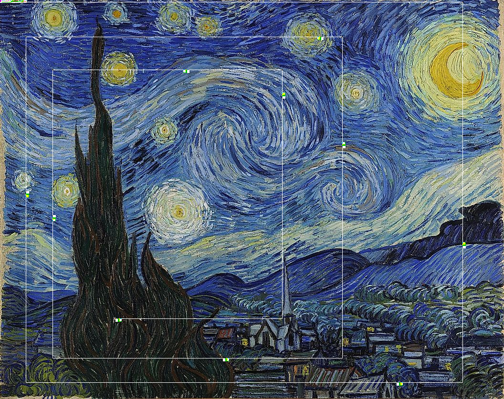

# Pierated Art
## Description
>Downloaded some art from a sketchy torrent provider (piet_pirate), and there are scribbles all over it.
>
>Update: The passwords (not the flag) are in lowercase ASCII
>
>Challenge sponsored by Battelle
## Attachments
`$ nc pierated-art.chal.uiuc.tf 1337`

# Images (in Base64)
Upon connecting to the server, we get what seems to be image base64 data, then a prompt to enter a flag with a 15 second timer.
```
Torrented Picture Data (Base64):
iVBORw0KGgoAAAANSUhEUgAAAyYAAAQACAIAAACbB9rAAAEAAElEQVR4nOz9d5gc13UmjJ9T1bmnp3syBsBEzCAQORAgIZJgEKNEUmISKUsOsmVLDlqnDd7ve/a3u79dr71rSbbXsmTJkhUtK1AiRYqUKIkEmCNyxiRMzh1mpnPd8/1R6VZ1dU9PwAAE7/vwIXpqbt1769adum+/77mn8CAcBIADBw/AzQAHDx2CAzffDHQQDh2AmwEA4SDBATgEcDMCEFh+UbQM3HzoEBwAwpsPwcGbDx44C...(goes on for a while)
Enter flag #1/10 (15s):
```
Taking too long causes the server to print `too slow!` and terminate the connection.

First let's see what the images actually look like. After using a simple base64 to image converter, I got



Very clearly looks like an edited picture of the famous Starry Night painting.

Zooming in to the top left corner where there seems to be some pattern:


After querying the server and compiling a lot of images (not shown here), I was able to see that
the top left remained fairly the same throughout, while the lines of white pixels and chunks of other pixels somewhat varied.

All of this (and the challenge title) pointed me towards the Piet esolang.

## Piet (and esolangs)
[Piet](https://www.dangermouse.net/esoteric/piet.html) is an esolang named after Piet Mondrian, a famous artist. 

An esolang, or esoteric programming language, is a programming language 
that isn't really intended to be used for actual programs, but instead offer unique or interesting ways to create programs.

In this case, Piet uses the pixels of an image to describe instructions. Piet also only uses one internal
stack to store data, and all values are pure integers. Most of the instructions modify the stack or are used for input/output.
You can find out more on their [documentation site.](https://www.dangermouse.net/esoteric/piet.html)

Luckily, there were also some helpful tools for Piet on the site. I decided to use a decompiler/compiler called repiet.

## repiet
(Repiet)[https://github.com/boothby/repiet] is a 'recompiler' for Piet, and it pretty much saved me on this challenge. 
It can be installed via pip, and run directly from the command line.
```
usage: repiet [-h] [-o OUTPUT] [-b {c,c++,piet,python,repiet}] [-O OPTIMIZE] [-x] [--codel_size CODEL_SIZE] source
```
We can use it to turn the images into Python or C source code and run them locally.
Decompiling to python, we can see some predefined code at the beginning:
```python
stack = []
def psh(*X): stack.extend(X)
def pop(): return stack.pop() if stack else None
def pop2(): return (None, None) if len(stack) < 2 else (stack.pop(), stack.pop())
def rll(x, y):
 x %= y
 if y <= 0 or x == 0: return
 z = -abs(x) + y * (x < 0)
 stack[-y:] = stack[z:] + stack[-y:z]
```
As well as some functions labeled `X[number]Y[number]()`, probably representing what each pixel does as a function:
```python
# some examples
def x0y0():
 stack.append(8)
 return x2y0
def x13y0():
 a,b = pop2()
 a is not None and psh(b+a)
 return x14y0
def x48y0():
 a = pop()
 a is not None and print(chr(a&255), sep='', end='', flush=1)
 return x49y0
def X39Y351():
 a = pop()
 a is not None and psh(int(not a))
 return X39Y350
def x54Y3():
 a = input()
 psh(ord(a))
 return x53Y3
```
And finally the actual runner:
```python
if __name__ == "__main__":
    bounce = x0y0
    while bounce is not None:
        bounce = bounce()
```
## Passwords
Now that the program is extracted to python, it can also be run seperately.

Running the program gives us an input for a flag. The input is read a character at a time (on Python this means each character is in a seperate input).
Finally, after entering in enough letters, the program will either output `1` if the flag is correct or `0` is the flag is wrong. 

Taking a peek into the code again, the last few functions before the 1 or 0 is printed can be grouped into one larger function that evaluates a letter 
in the input (which is stored on the stack).
```python
def a():
 stack.append(2)
 return b

def b():
 stack.append(1)
 return c

def c():
 a,b = pop2()
 a is not None and rll(a,b)
 return d

def d():
 stack.append(k) # only number changes between groups
 return e

def e():
 a,b = pop2()
 a is not None and psh(b+a)
 return f

def f():
 stack.append(26)
 return g

def g():
 a,b = pop2()
 a is not None and a!=0 and psh(b%a)
 return h

def h():
 a = pop()
 a is not None and psh(int(not a))
 return i

def i():
 a,b = pop2()
 a is not None and psh(b*a)
 return nextgroup

# is all equivalent to

def combined():
    prev = pop() # starts at 1 for first group
    a = pop()
    if (a + k) % 26 == 0:
        psh(1 * prev)
    else:
        psh(0 * prev)
    return nextgroup
```
If all the groups evaluate to `1`, then the final output will also be `1`, meaning the correct password was supplied. 
Meaning if the `k` values can be extract through all the groups, the password can be reverse generated and submitted to the server.

## Patterns
After repeatedly downloading images from the server and converting them to code, I managed to notice a pattern in the 
decompiled python. For all the images, the function `x56y3` always led to the first letter evaluation group
described earlier. Also, each group always seemed to share the same pattern.
```python
def X56y3():
 return X767y473 # first group
...
def X767y473(): # function of 3 lines that appends 2
 stack.append(2)
 return X767y475

def X767y475(): # function of 3 lines that appends 1
 stack.append(1)
 return X767y476

def X767y476(): # function of 4 lines that essentially swaps the first and second element from the top of the stack
 a,b = pop2() # (also 1 and 2 get removed)
 a is not None and rll(a,b) 
 return X767y477

def X767y477(): # function of 3 lines that appends k
 stack.append(22)
 return X767y479

def X767y479(): # function of 4 lines that adds k to the input-supplied letter
 a,b = pop2()
 a is not None and psh(b+a)
 return X767y480

def X767y480(): # function of 3 lines that appends 26
 stack.append(26)
 return X767y482

def X767y482(): # function of 4 lines that appends (input + k) % 26
 a,b = pop2()
 a is not None and a!=0 and psh(b%a)
 return X767y483

def X767y483(): # function of 4 lines that flips the top most element
 a = pop()
 a is not None and psh(int(not a)) # 0 becomes 1, anything else becomes 0
 return X767y484

def X767y484(): # function of 4 lines that multiplies prev and the result from the last function
 a,b = pop2()
 a is not None and psh(b*a)
 return X767y485

def X767y485(): # function of 2 lines that goes to the next group
 return Y952x685 
```
While `k` changed between the groups, the number of lines in each function did not. This meant that
by directly reading the source code, each value of `k` could be extracted. <br />
To test this, I created a small test script:
```python
code = open("out.py","r").read()
lines = code.split("\n")
comp = compile(code, 'code', 'exec')
# find function labeled X56y3
f = 0
for line in lines:
    if "def X56y3():" in line:
        f = lines.index(line)
        break
f = lines[f+1].split(" ")[-1]
print(f)
g = 0
for line in lines:
    if "def "+f+"():" in line:
        g = lines.index(line)
        break
kvals = []
print(g)
while True:
    g = g + 4 + 4 + 5
    k = int(lines[g+1].split("(")[-1].replace(")",""))
    print(k)
    kvals.append(k)
    g = g+4+5+4+5+5+5
    if "print" in lines[g+2]:
        break
    g += 3
    # print(g)
print(kvals[::-1])
```
From here, I got stuck during the contest because there seemed to be multiple different possible values for the password.
For example, for k's of `[7, 20, 4, 9, 11, 7, 16, 26, 19, 22]`, both `8;4>GCEJ:G` and `RUNXa]_dTa` were valid, and even
output a 1 when the program was run. However, submitting either to the server didn't work.

I had to open up a support ticket and get help :cry: Fortunately my ticket got them to send out a hint:
>Update: The passwords (not the flag) are in lowercase ASCII

## Alphabet
Given that hint, finding the message was now pretty easy, just iterate through all the lowercase letters
and find one that fits the k value.
```python
msg = ""
for k in kvals[::-1]:
    for c in 'abcdefghijklmnopqrstuvwxyz':
        if (ord(c)+k)%26 == 0:
            msg += c
            break
print(msg)
```
Now the previous `[7, 20, 4, 9, 11, 7, 16, 26, 19, 22]` gives us an output of `andywarhol`.
Andy Warhol was the name of a famous American artist, which totally fits the theme of this challenge, meaning this is probably
the correct password. 

Now all that's left is the automation.

# Automation
The base64 to image can be automated using 
```python
img = base64.b64decode(img)
img = Image.open(io.BytesIO(img))
img = img.convert('RGB')
filename = 'img.png'
img.save(filename)
```
and then repiet can be directly called from `os.system`
```python
os.system('repiet -o out.py -b python '+filename)
time.sleep(2) # required to make sure it actually finishes
```
Then the password generation script can be run using `out.py` as the source code and finally the password can be passed to the server.

## Final solve script
```python
import io
import pwn
#nc pierated-art.chal.uiuc.tf 1337
s = pwn.remote('pierated-art.chal.uiuc.tf', 1337)
# base64 to image
from PIL import Image
import base64
import os
import time
for i in range(10):
    s.recvline_contains(b'(Base64):')
    img = s.recvline().decode('utf-8')
    # print(img[:10], img[-10:])
    img = base64.b64decode(img)
    img = Image.open(io.BytesIO(img))
    img = img.convert('RGB')
    filename = 'img.png'
    img.save(filename)
    os.system('repiet -o out.py -b python '+filename)
    time.sleep(2)
    code = open("out.py","r").read()
    lines = code.split("\n")
    comp = compile(code, 'code', 'exec')
    # find function labeled X56y3
    f = 0
    for line in lines:
        if "def X56y3():" in line:
            f = lines.index(line)
            break
    f = lines[f+1].split(" ")[-1]
    print(f)
    g = 0
    for line in lines:
        if "def "+f+"():" in line:
            g = lines.index(line)
            break
    msg = ""
    print(g)
    while True:
        g = g + 4 + 4 + 5
        num = int(lines[g+1].split("(")[-1].replace(")",""))
        # print(num)
        for i in range(ord('a'), ord('z')+1):
            if (i + num) % 26 == 0:
                msg += chr(i)
                break
        g = g+4+5+4+5+5+5
        if "print" in lines[g+2]:
            break
        g += 3
        # print(g)
    msg = msg[::-1]
    print(msg)
    s.sendline(msg.encode('utf-8'))
s.interactive()
```

Running that gives the flag and some cute flavortext.
```
>>> Enter flag #10/10 (15s):Correct!
>>> i'll just use google images next time :D
>>> uiuctf{m0ndr14n_b3st_pr0gr4mm3r_ngl}
```

## Conclusion
Surprisingly this was the first challenge to use an esolang (except maybe a BF one but idk) that I've done, so was pretty nice.
Also managed to get the blood on this one which I'm pretty happy about.