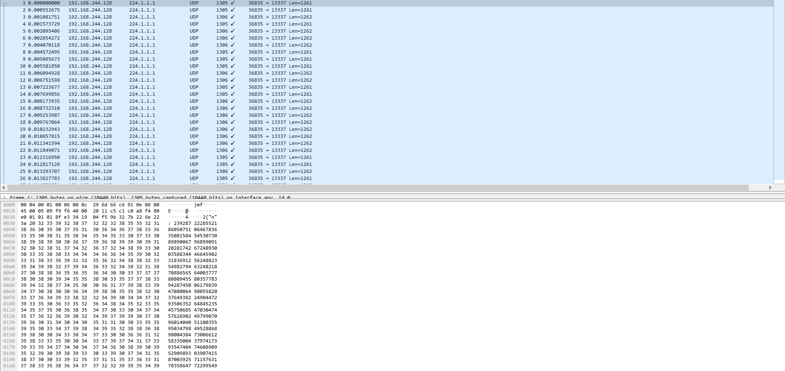

# Beacon
> We recently detected some strange network activity that could be botnet traffic. There are messages being broadcast by a beacon but they are all encrypted. Can you find out what the hackers are sending out?
---

The challenge gives us a single pcap: [beacon.pcapng](beacon.pcapng)


Opening up the pcap, we see a lot of UDP packets, each sending some JSON data containing an RSA encryption.
After extracting all the JSON into its own [file](data.json), we get 50 different messages.
Hopefully, each message is just the flag encrypted with a different private key, but that's just an assumption we will make for now.

## Red Herring
At first glance, cracking any single message seems improbable. Factoring n would take too long, so there must be some other method.

We are given 50 different messages, so given a quick search online for attacks on multiple RSA messages, we find 
[Hastad's Broadcast Attack.](https://en.wikipedia.org/wiki/Coppersmith%27s_attack#H%C3%A5stad's_broadcast_attack)

However, there's just one small issue. Hastad's attack requires at least `e` different messages, where `e` is the public key.
In this case, we would need 65537 messages! However, we are only given 50. Seems like this isn't the right attack then...

## Occam's Razor
After staring at the data for a little longer, I came to a pretty astounding revelation.

It was completely possible that in the 50 different `n` values, two of them could share a prime factor.
After writing a small script to detect for a possible collision, we actually find one!
The 6th and 30th message share a single prime factor. This makes factoring the modulus of each message
simple as we can just take the GCD of the two `n` values to find a prime factor.
```python
import sympy
i = 5
j = 29
n1 = Nlist[i]
n2 = Nlist[j]
q = sympy.gcd(n1, n2)
p = n1 // q
d = sympy.mod_inverse(Elist[i], (p-1)*(q-1))
m = pow(Clist[i], d, n1)
m = bytes.fromhex(hex(m)[2:]).decode('utf-8')
print(m)
```
After decrypting one of the messages, we get
`Secret meeting at 16:30 UTC at the usual place. The password for entry is: USCG{C0mm0n_f@ct0r5_FtW}`

Our flag is `USCG{C0mm0n_f@ct0r5_FtW}`