# Rev/Hardest Demon Bloodbath by Riot
Author: Plasmatic#0001

> Whose blood will be spilt in the Bloodbath? Who will the victors be? How many will survive? Good luck...
> 
> Geometry Dash Level ID: 87752310
> 
> Level Name: CTFCHALL2022
> 
> Player ID: TLWv2

> Note: Wrap the flag with idek{}
---
| Table of Contents |
| ----------- 
|[Getting the level](#getting-the-level)|
|[Editor analysis](#editor-analysis)|
|[This is taking too long](#this-is-taking-too-long)|
|[Giant wall of stuff and a big purple carpet](#giant-wall-of-stuff-and-a-big-purple-carpet)|
|[Rererecursion](#rererecursion)|
|[Conclusion](#conclusion)|
---

# Getting the level
Very obviously, the challenge seems to take place in a Geometry Dash Level. Fortunately I have the game on hand ~~rip to those who had to spend $3~~, so pasting in the ID into the search, we get a seemingly normal level. 

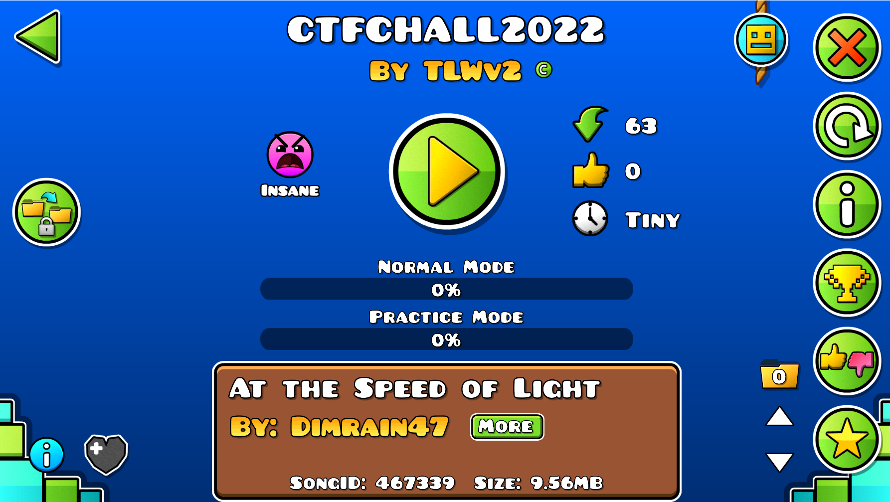

Unfortunately, it seems we need a passcode to create a local copy to edit and mess around with.

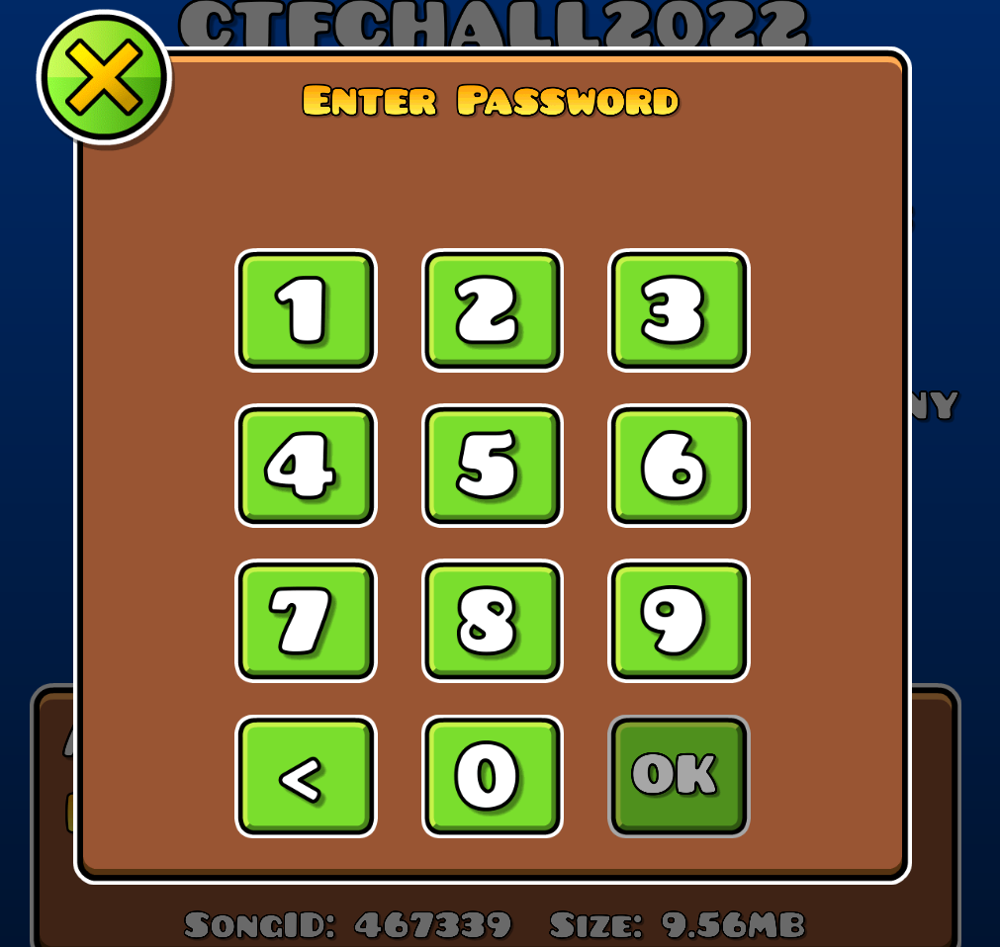

But I also happen to have Mega Hack, so we can easily bypass the passcode requirement. You can get Mega Hack v5 for free from [here](https://www.youtube.com/watch?v=zJ-s7lvD1j4&ab_channel=Absolute) (though it opens up the creator's Twitter every time you launch :joy:). 

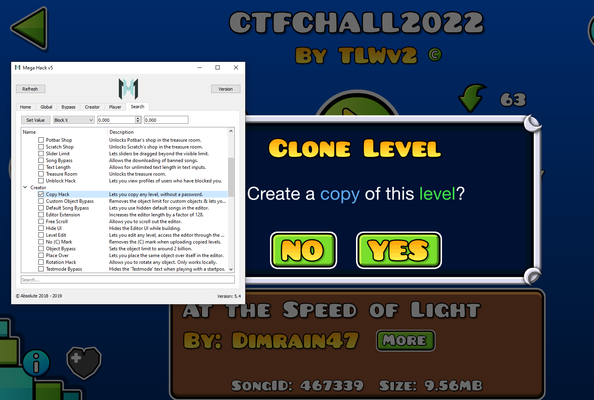

Now that we have a local copy of the level, we can actually start the reverse engineering part.

You can also do this part without Mega Hack, but I wanted access to the editor to play around with the level.

# Editor analysis
After getting a local copy, we can open it in the editor and see what is actually in the level.
With Mega Hack, we can also allow free scroll and infinite zoom in the editor. 

Here's a zoomed out view of what the level looks like (redone beautifully in paint by yours truly)

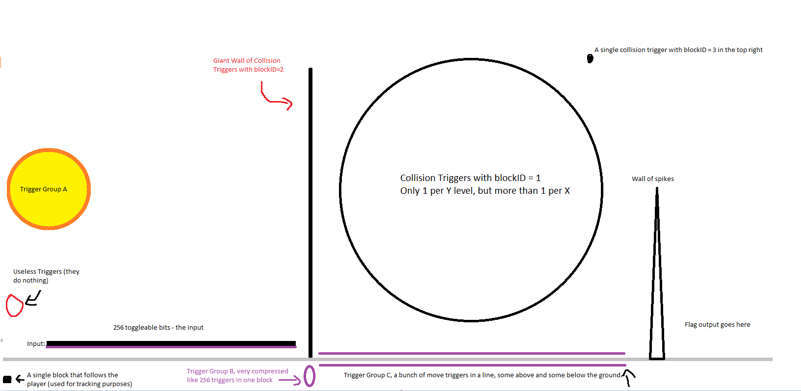

Let's start by looking at what we're interested in: the flag.

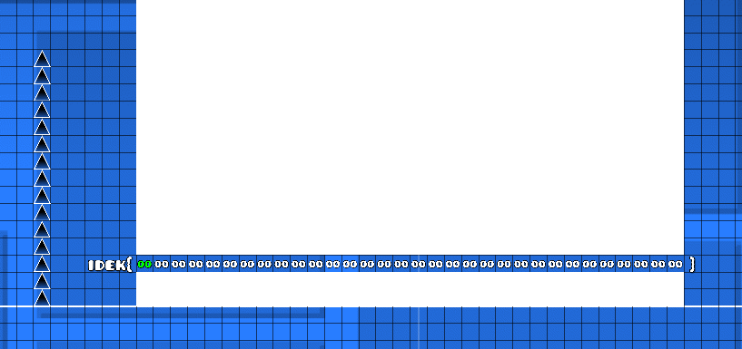

For each character between the braces, they are a part of a different group. Behind the white squares are more letters, and they each form 32 columns 
of 256 possible values, representing ASCII values. Each column also has its own trigger group, a value that indicates what triggers will affect an object or a group of objects (so in this case a move trigger with target group 645 or 1001 would move this column)

**Side note: all objects in this level have target group 1001, not sure why but it doesn't do anything**

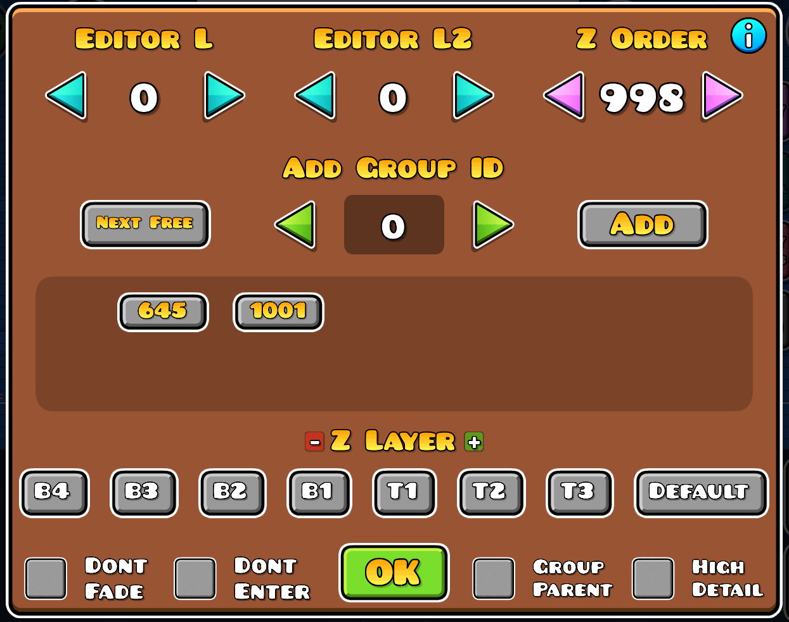

Clearly, we somehow need to get past the spikes to view the flag. Looking at each spike, we can see that they all have a trigger group of 7. So if we can somehow get a trigger
with target group 7 to remove these spikes, we should be able to win the level and capture the flag.

## Trigger group A
Now unfortunately, there's not really a good way to search in the Geometry Dash editor, but the only move trigger with target group 7 occurs in the trigger group A from the level image
above, so let's take a look at that now.

First, let's explain what triggers are first.

In Geometry Dash, triggers are objects that affect the level in some way, such as moving an object, toggling them on and off, spawning an object, or checking for collisions.
They can be activated when the player passes by them (the default), when the player touches them, or by other triggers.

For this level, all of the move triggers that have meaningful roles only trigger when the player touches them, so keep that in mind for the future sections.

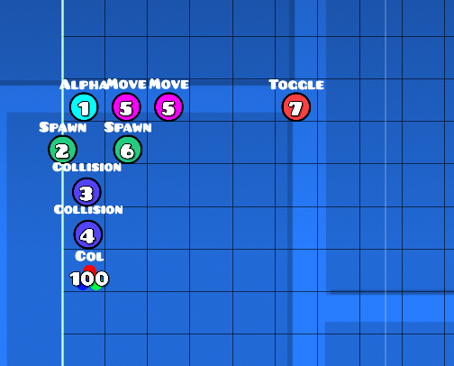

The alpha and color trigger are only visual, so they can be ignored.

First let's look at the toggle trigger marked 7. 

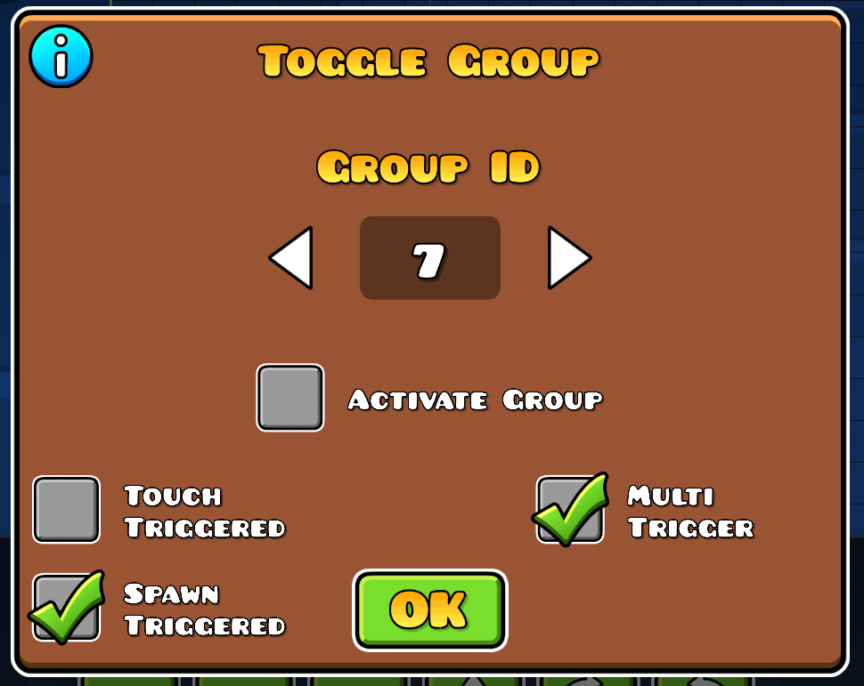

It gets activated whenever the trigger spawns (spawn triggered), and it can also be activated multiple times (multi trigger). But more importantly, the target group id is 7, the group of the spikes we want to remove. This means whenever this trigger is activated, the spikes will be toggled off, allowing us to reach the flag.

Looking further, the toggle trigger has its own trigger group of 4, so let's take a look at that collision trigger next.

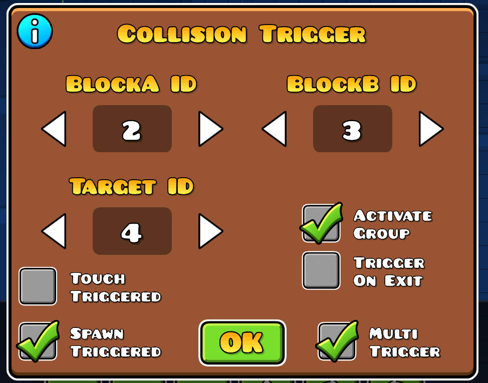

This trigger checks for collisions between objects with blockID A and blockID B, and when it does, it activates the triggers (activate group) in group 4.
From the map earlier, only one block has blockID B, so the goal must be getting that block to collide with the massive wall.

**Move triggers**

Now the two move triggers marked group 5. One of them has trigger group 3, and moves all objects in group 5 up by 10 units. The other has trigger group 6, and moves all objects in group 5 down by 10 units.

The spawn trigger marked group 6 has trigger group 3 as well, and activates group 6 whenever it is spawned, with a delay of 0.20 seconds.

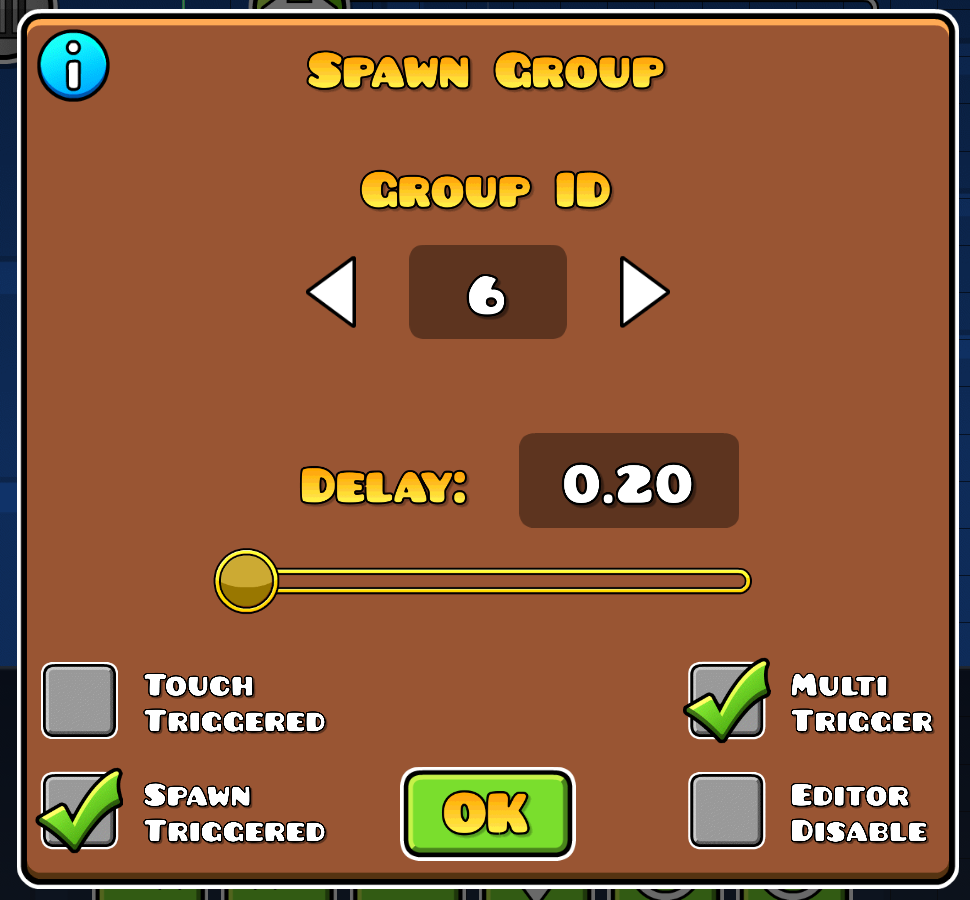

Combined, this means whenever trigger group 3 is activated, all objects in group 5 move up 10 units (one block in the editor) then move down 10 units after 0.2 seconds.
And as for how trigger group 3 is activated, that comes from the collision block labeled 3, which checks for collisions of blockID 2 and blockID 1. 

So any time a block with ID 2 collides with a block with ID 1 all objects in group 5 move up then down.

Finally, the spawn trigger marked 2 initiates the two collision triggers and basically tells them to start listening for collisions.

# This is taking too long
At this point I was getting bored of staring at the editor and wanted a better way to analyze the level. 
Looking around online, I stumbled upon [this interesting tool](https://github.com/hiimjustin000/gd-level-to-json-cli), which let me convert the level into pure JSON.

Now that I had the [level in JSON](data/level.json), I created a small script to filter out objects based on what trigger group they had as well as if they affect 
a specific trigger group.

Something interesting is that apparently when the level got converted to JSON, all the distance values got multiplied by 3. I'm not sure why 
it seems to be stored different internally but just know that for all future triggers and movements, the JSON values are 3 times the value in the editor
(so a move of 30 units is still one block)
```py
import json

known_objs = {
    94: "black box",
    1816: "collision trigger",
    901: "move trigger",
    914: "text",
    8: "spikes"
}

data = open("data/level.json", "r").read()
data = json.loads(data)

objs = data["objects"]

GROUP_OF_INTEREST = 9 # move trigger id of first input bit

print("objs with trigger group", GROUP_OF_INTEREST)
for obj in objs:
    if not 'triggerGroups' in obj.keys():
        continue
    if GROUP_OF_INTEREST in obj['triggerGroups']:
        if obj['id'] in known_objs:
            print(known_objs[obj['id']], end=" ")
        print(obj)

print("\ntriggers that target group", GROUP_OF_INTEREST)
for obj in objs:
    if obj['id'] == 901:
        if GROUP_OF_INTEREST == obj['targetGroupID']:
            print(obj)
```

With this new script, parsing the level became a lot easier. 

As it turns out, each input bit trigger does 3 things. First, it moves a block to the change the input bit from 0 to 1.
Then, it moves one of the collision triggers in the giant wall upwards by one block, and finally, it moves a move trigger upwards right under the giant wall.

The move trigger that moves upwards actually shifts a column in the flag downwards by a certain amount of blocks, essentially mimicking setting a bit in the flag.
So the flag is actually just the decoded input bits as bytes.

For the collision trigger in the wall that moves upwards, each input bit is mapped to a unique collision trigger, but not all of them are used. Some of the collision triggers
are affected by the move triggers in trigger group C, rather that being set by the input bits.

# Giant wall of stuff and a big purple carpet
After a little more searching and parsing, I noticed that each collision trigger in the wall with blockID 2 had a corresponding collision trigger with blockID 1 somewhere
in the space above trigger group C.

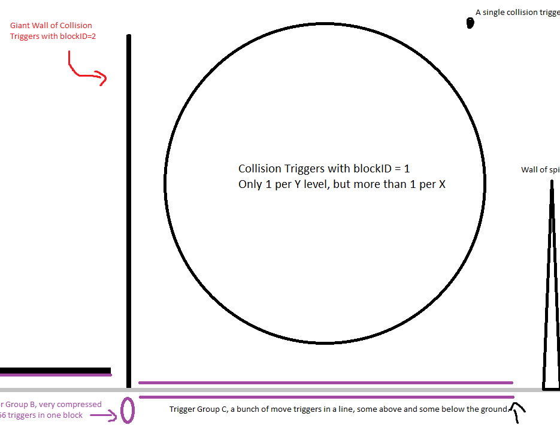

Each blockID 2 trigger had a blockID 1 trigger somewhere at the same Y level, or exactly one block up. This means that whenever a certain collision trigger
is moved upwards, it either moves into the path of the blockID 1 trigger and will collide with it, or it moves out of the path of the blockID 1 trigger.
At the very top, the blockID 2 trigger instead had the final corresponding blockID 3 trigger needed to get the flag.

When the player first passes through the wall, they hit all the move triggers that shift the columns in the flag to set the flag, then also activate a follow
trigger for group 265, a group that all the collision triggers in the wall are in. This causes the wall to follow the player as we continue moving through the level,
meaning at some point every collision trigger in the wall will either collide with a blockID 1 trigger or move out of the way.

As for the large group of move triggers on the ground, they were all a part of trigger group 5, which was the group that would move up and down whenever the collision between
blockID 2 and blockID 1 was triggered. However, some of the move triggers are below the ground, while some are above. If the collision trigger activates while we pass
a move trigger below the ground, the move trigger would itself move upward, and we would touch it, causing it to trigger. However, if the move trigger was already above the ground,
it would move itself upward out of our way, and we would not touch it. Essentially, this acts like an XOR gate. 

**Side note again: You can't jump in the section after the giant wall, so you have to pass through all the move triggers, either activating them by touch or sliding by them.**

There's just one small problem, which was that although the collision triggers in the wall each had a corresponding blockID 1 trigger at a unique Y level, there was
no such restriction on X level. This means that if two collision triggers with block ID 1 are at the same X level, they could both affect the move trigger we are 
passing through. With some local testing, I found that if two collisions happen at the same time, the trigger is still only activated once, so there was no need to worry about
doubling up on the movement. Still, this was a special case that I had to account for.

The final goal was to have the collision trigger in the wall collide with the one that had block ID 3, which was moved by a trigger on the ground. That trigger on the ground could
move up and down based on the collision triggers at its X level, and those triggers are affected by other triggers on the ground and so on and so forth. Eventually, the triggers
reach the ones that we set with the input bits, so that's how we reach the solution and get the flag.

# Rererecursion
With all of this information, it's time to write a script to recursively solve for a given collision trigger and either have it collide or not. I treated the block ID 1 collision triggers as switches to be pressed, the giant wall as toggleable values, and every movement trigger as a trigger for the toggleable values.

So basically every `toggle` in the wall is moved up by a `trigger` on the ground. Each `trigger` also moves up if any `toggle` has the same value as its `switch` whenever
the player/the wall passes that `switch`. If the `trigger` is above ground and moves up, we slide past the `trigger` and don't activate it, meaning the `toggle` stays in place and doesn't 
move upward. If the `trigger` is below ground and moves up, we would then touch it, moving the `toggle`. Moving the `toggle` or having it stay in place could both either make it
activate or not activate the `switch`.

Before starting the script, I first parsed out all the useful parts of the level.
```py
toggles = json.loads(open("data/toggles.json", "r").read())

for obj in objs:
    if not 'triggerGroups' in obj.keys():
        continue
    if 265 in obj['triggerGroups']:
        # if obj['id'] in known_objs:
        #     print(known_objs[obj['id']], end=" ")
        # print(obj)
        toggles.append(obj)

print(len(toggles))

switches = []

for t in toggles:
    y = t['y']
    for obj in objs:
        if obj['y'] == y or obj['y'] == y + 30:
            if obj['id'] == 1816 and obj['itemA'] != 2:
                switches.append(obj)

print(len(switches))

triggers = []

for obj in objs:
    if obj['id'] == 901:
        if 266 <= obj['targetGroupID'] <= 644:
            triggers.append(obj)

with open("triggers.json", "w") as f:
    f.write(json.dumps(triggers, indent=4))

print(len(triggers))
```
I then dumped these into their own JSON files [switches.json](data/switches.json), [toggles.json](data/toggles.json), and [triggers.json](data/triggers.json) so I could easily access them later in the final script instead of having to parse the level every time.

I also created these helper functions to improve readability and make creating/debugging easier. (yes I know my code is spaghetti)
```py
def getSwitchFromToggleY(y):
    for s in switches:
        if s['y'] == y or s['y'] == y + 30:
            return s

def getSwitchesFromTriggerX(x):
    ret = []
    for s in switches:
        if s['x'] == x:
            ret.append(s)
    return ret

def getToggleFromSwitchY(y):
    for t in toggles:
        if t['y'] == y or t['y'] == y - 30:
            return t

def getTriggerFromSwitchX(x):
    for t in triggers:
        if t['x'] == x:
            return t

def getToggleFromGroupID(id):
    for t in toggles:
        if id in t['triggerGroups']:
            return t

def getTriggerFromGroupID(id):
    for t in triggers:
        if id == t['targetGroupID']:
            return t
```
And now after all this setup, we can finally *finally* write the solver for the problem:
```py
def rec(switch, active=True):
    final = []
    # target is a switch, set it to active
    y = switch['y']
    toggle = getToggleFromSwitchY(y)
    trigger = getTriggerFromGroupID(toggle['triggerGroups'][1])
    move = not (active ^ (toggle['y'] == y - 30))

    if trigger == None:
        # no trigger to solve for, must be set as part of input bits
        # if we have to move it, then input bit is set to 1, else 0
        return [toggle['triggerGroups'][1]] if move else []

    on = int(trigger['y'] == 15)
    switches = getSwitchesFromTriggerX(trigger['x'])

    # move the toggle XOR is trigger on
    # if we have to toggle and the trigger is already on, switches must be off
    # if we have to toggle and the trigger is off, switches must come on
    # if we don't toggle and the trigger is on, switches must come on
    # if we don't toggle and the trigger is off, switches must be off
    if move ^ on: 
        final += rec(switches[0], True)
    else:
        for s in switches:
            final += rec(s, False)

    return final
```

For the extra case we found earlier where multiple collision triggers were on the same X level, it turns out that case never appears when at least one switch must be on.
With some debug output, whenever the switches have to be activated, there's only one switch at the particular X level. So we can rule out this case and just use the first element
in the list as the switch.

Running the script, we get this output
```py
# switch with itemA = 3
target = {'id': 1816, 'x': 49695, 'y': 38145, 'triggerGroups': [1001], 'scale': 0.85, 'itemA': 3}
rec(target)

>>> [170, 91, 146, 248, 79, 133, 260, 26, 21, 190, 130, 173, 236, 58, 219, 235, 16, 151, 181, 138, 131, 47, 216, 220, 70, 152, 50, 109, 75, 127, 168, 197, 14, 144, 227, 198, 99, 211, 46, 212, 256, 176, 195, 83, 141, 115, 122, 42, 184, 53, 205, 59, 187, 34, 174, 54, 63, 11, 182, 232, 87, 203, 110, 64, 56, 124, 149, 171, 18, 191, 142, 88, 12, 136, 150, 111, 189, 154, 218, 194, 210, 259, 135, 202, 118, 155, 251, 243, 76, 23, 67, 108, 72, 31, 166, 183, 179, 186, 215, 35, 84, 158, 106, 112, 22, 40, 240, 264, 74, 98, 66, 222, 55, 90, 114, 148, 94, 123, 10, 119, 208, 139, 163, 96, 27, 52, 45, 178, 43, 134, 82, 102, 162, 68, 19]
```
which we can easily convert to bytes and claim our flag! (remember that 9 is the target group of the first input bit, and the function solves for target groups)
```py
init = rec(target)
init = [i-9 for i in init] # 9 is the first trigger

bits = [0] * 256
for i in init:
    bits[i] = 1
bits = ''.join([str(b) for b in bits])

from Crypto.Util.number import long_to_bytes
print(long_to_bytes(int(bits, 2)).decode())

# unban_cursed_from_demonlist!1!!1
```
`idek{unban_cursed_from_demonlist!1!!1}`

# Conclusion
This was a really fun and creative challenge, even though most of it is actually just decomposing the level into something thats readable and workable with. The actual rev part isn't too intense, I would say this is closer to a misc challenge than anything. 
Could've came close to blooding, but solving it was still nice.